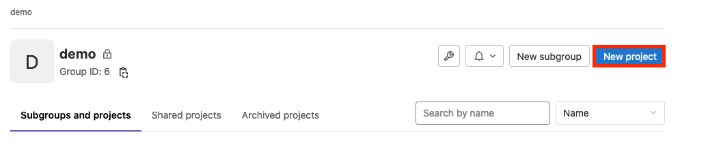
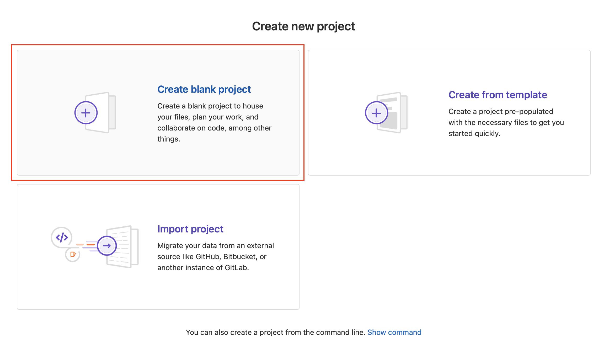
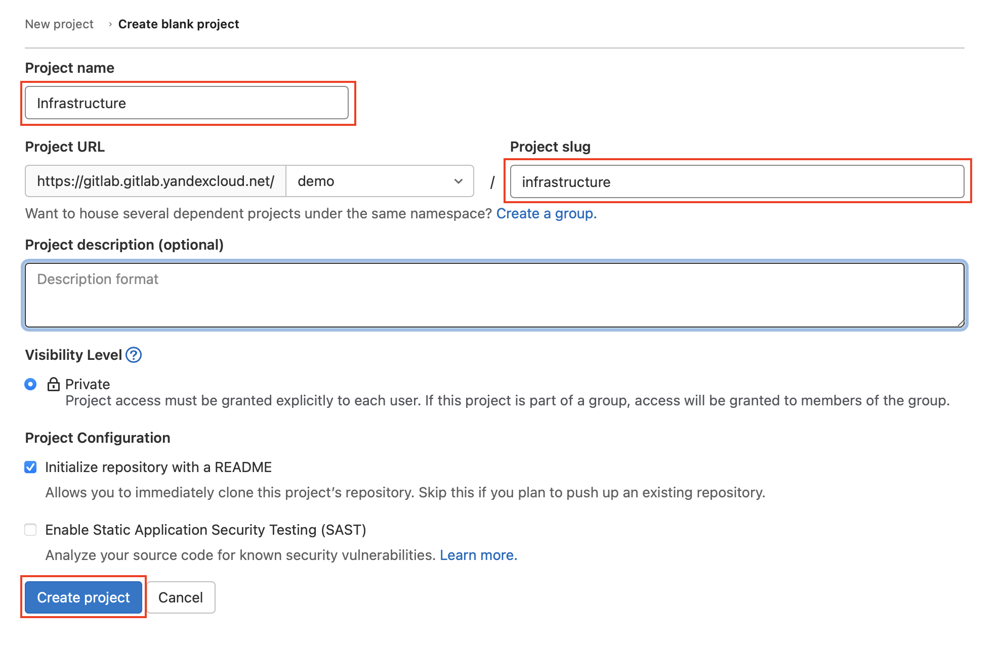
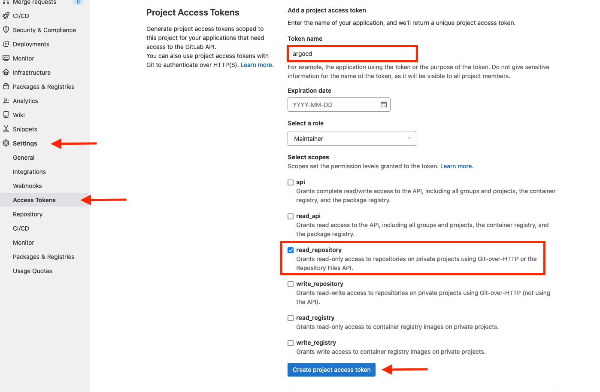
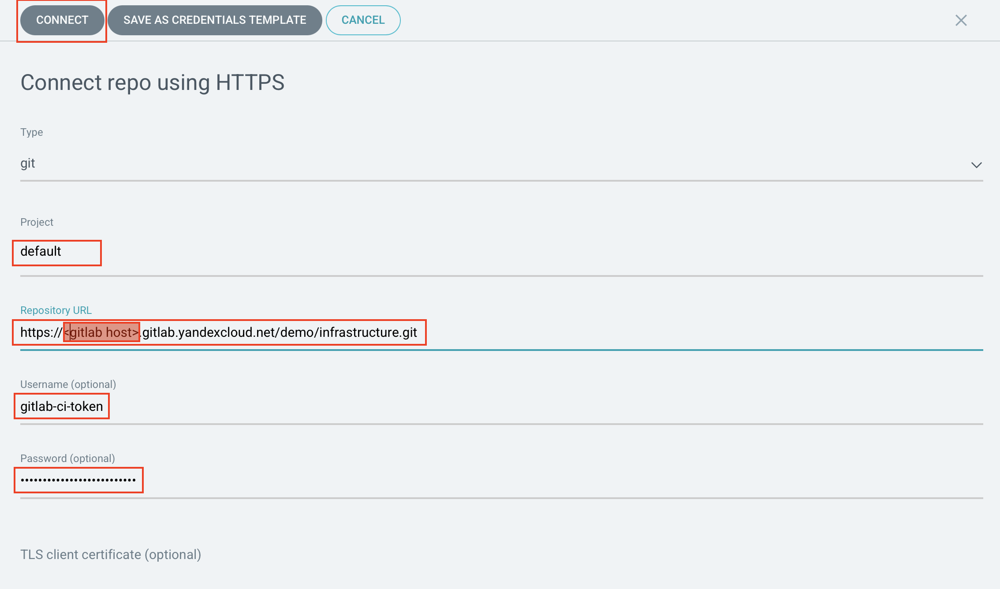

# Argo CD

## Установка Argo CD

Установите [argo-cd](https://argoproj.github.io/cd/) из маркетплейса.

* Для этого перейдите в вэб-консоль, выберите только что созданный кластер Kubernetes
и перейдите в раздел `Marketplace`.

* Выберите продукт ArgoCD.

* Нажмите кнопку Использовать.

* Нажмите кнопку Установить.

* Для получения доступа к UI ArgoCD, подключитесь к кластеру
c помощью механизма port-forwarding

```bash
kubectl port-forward svc/argo-cd-argocd-server 8443:443
```

После запуска port-forward консоль argocd будет доступна по адресу `https://127.0.0.1:8443`

> Имя пользователя для входа в консоль: admin

> Пароль для первого входа нужно извлечь из secret
> ```bash
> kubectl get secret argocd-initial-admin-secret \
>  -o jsonpath='{.data.password}' | base64 -d
> ```

## Подготовка репозитория описания инфраструктуры

* В созданном в предыдущей инструкции Gitlabе создайте
новый репозиторий `infrastructure` в группе `demo`





* Создайте авторизационный ключ для созданного ранее сервис аккаунта

```bash
yc iam key create --service-account-name image-pusher -o key.json
```

* Перейдите в настройки созданного проекта и создайте переменные для работы
с Container Registry


| Name | Value | Protected | Masked |
|------|-------|-----------|--------|
| CI_REGISTRY | cr.yandex/\<container registry id\> | `no` | `no` |
| CI_REGISTRY_USER | json_key | `no` | `no` |
| CI_REGISTRY_PASSWORD | <вывод команды `cat key.json \| base64`> | `no` | `yes` |

> key.json - файл полученный на предыдущем шаге создания авторизационного ключа

# Добавление репозитория

* Создайте токен для подключения к репозиторию: в вэб интерфейсе Gitlab на странице репозитория -> Settings -> Access Tokens. Укажиет имя и отметьте разрешение `read_repository`



> :warning: **Не закрывайте страницу после создания токена**, на следующем шаге
> он нам понадобится. Достать его значение после закрытия страницы невозможно!

* В вэб-консоли ArgoCD перейдите в разедл Argo CD -> Settings -> Repositories 

* Нажимите `Connect repo using HTTPS`

* В поле Repository URL укажите адрес репозитория `infratstructure`

> Адерс должен заканчивается на `.git`, его можно получить нажав кнопку Clone
> на странице проекта в GitLab и скопировав адерс из поля `Clone with HTTPS`

В поле Username укажите `gitlab-ci-token`

В поле Password вставьте токен из Gitlab, полученный на предыдущем шаге



Нажмите `Connect`. Если данные внесены корректно, в списке появится новый репозиторий с зеленой отметкой.


