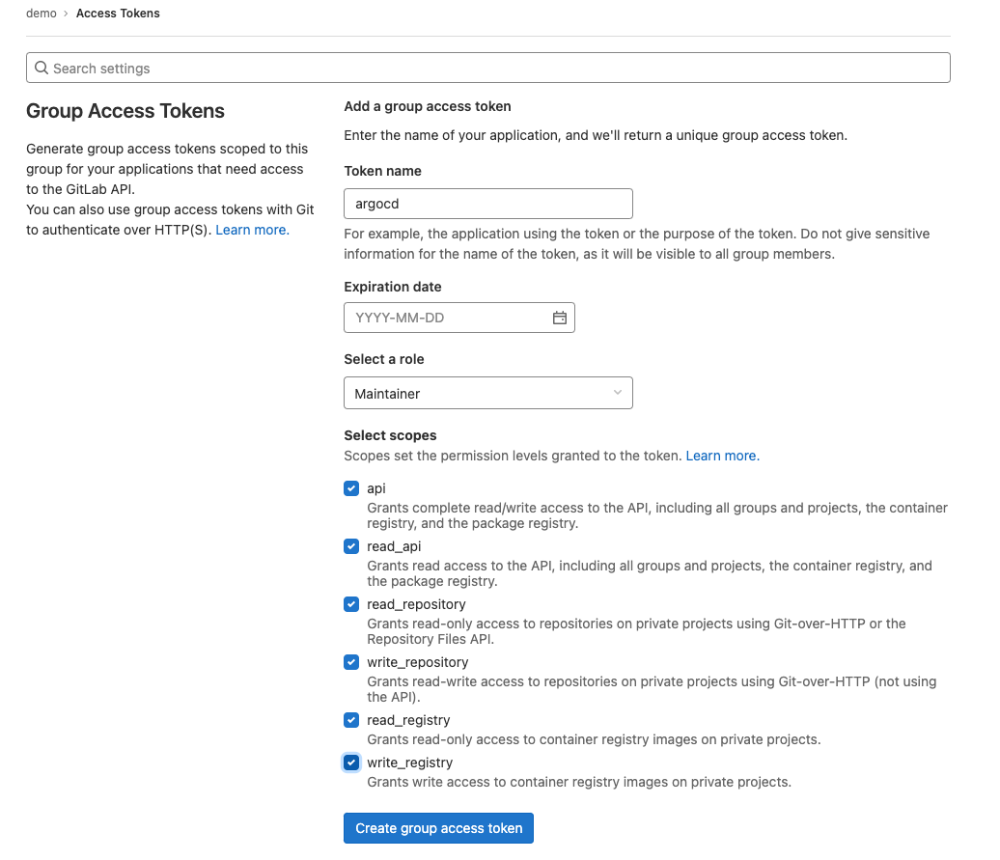
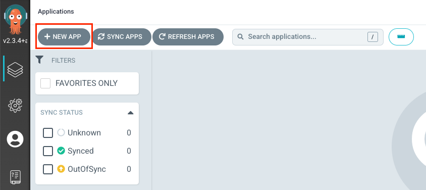
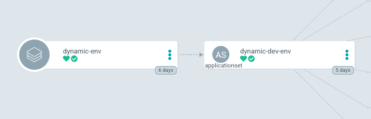
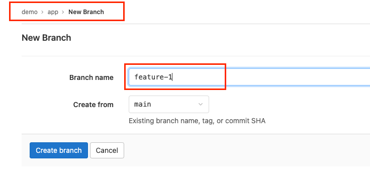
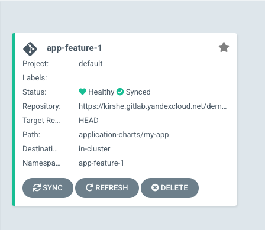

# Dynamic environments

## Создание проекта app в GitLab

<br/>

На данном этапе, в вашем GitLab-инстансе, созданном в [части 1](./01-mk8s-gitlab), создана группа `demo`.
Необходимо создать в этой группе новый проект `app`.

<br/>


<br/>

Создайте токен для подключения к GitLab. Для этого откройте вашу группу `demo` в GitLab, перейдите в раздел `Settings > Access Tokens` и создайте новый access token:

<br/>



<br/>

Значение созданного токена необходимо скопировать в `./gitlab-token.yaml`. Убедитесь, что указан верный `namespace` в манифесте – он должен соответствовать `namespace`-у, в котором установлен ArgoCD. После этого, можно применить манифест через `kubectl apply -f gitlab-token.yaml`.

<br/>

> После создания токена, необходимо удалить под `argocd-applicationset-controller`, чтобы инициировать его пересоздание.

<br/>

Также, необходимо задать переменные окружения для gitlab-runner – необходимо открыть группу `demo` в Gitlab и перейти в раздел `Settings > CI/CD > Variables`. Необходимо указать переменные для подключения к container registry:

<br/>


<br/>

Данные переменные задавались ранее, в [части 2](./02-argocd). Необходимо убедиться, что они действуют для группы `demo` и для проекта `app`. Если переменные отсутствуют – их нужно создать.

Склонируйте созданный репозиторий, скопируйте в него содержимое папки `../projects/app` и сделайте `git push`. 
Убедитесь, что в репозитории существует файл `.gitlab-ci.yml` и что build-задача была выполнена успешно. В результате должен собраться новый образ и загрузиться в container registry, указанный в переменных GitLab. Имя собранного образа можно увидеть в журнале выполнения build-задачи – оно потребуется далее.

<br/>

> Убедитесь, что репозиторий `app` добавлен в ArgoCD. Добавление репозитория в ArgoCD описано в [части 2](../02-argocd/).

<br/>

## Создание проекта infrastructure в Gitlab

<br/>

В предыдущей [части](./04-secure-clusters) вы должны были создать новый проект `infrastructure` в группе `demo`.
Если вы этого не сделали, просто создайте новый проект `infrastructure` в группе `demo`, склонируйте его и скопируйте туда содержимое папки `../projects/infrastructure`. После чего, не забудьте сделать `git push`.

В папке `infrastructure/application-charts/my-app/values.yaml` репозитория `infrastructure` необходимо указать имя собранного образа, в репозитории, который вы указали в переменных GitLab. Тег указывать не нужно. Если образ не был собран, проверьте успешность работы build-задачи в проекте `app`.

<br/>

> Убедитесь, что репозиторий `infrastructure` добавлен в ArgoCD. Добавление репозитория в ArgoCD описано в [части 2](../02-argocd/).

<br/>

## Создание ApplicationSet

<br/>

Отредактируйте файл `../projects/infrastructure/application-sets/dynamic-envs/dev-envs.yaml`:

1. Необходимо указать адрес вашего Gitlab-инстанса в двух местах: в `scmProvider` и в `source`.
2. Убедитесь, что указан верный namespace, в котором установлен ArgoCD в кластере.
2. Измените адрес группы, если она отличается от `demo`.
3. Измените имя gitlab-token секрета, если оно отличается.
4. В качестве `destination` указан кластер по-умолчанию, в котором установлен ArgoCD. Если хотите использовать другой кластер, небходимо добавить его в ArgoCD и указать его имя здесь.
5. Указан проект `default` в ArgoCD.

<br/>

> В качестве фильтра в `scmProvider` используются `^feature` для веток репозитория и `^app` для репозиториев. Если вы создали новый проект с именем отличным от `app`, нужно изменить его в фильтре.

<br/>

Создайте приложение через интерфейс ArgoCD:

<br/>



<br/>

Заполните поля приложения и нажмите `Create`:
- Application name: `dynamic-env`
- Project: `default`
- Source Repository URL: `https://xxxxxx.gitlab.yandexcloud.net/demo/infrastructure.git`
- Source Path: `application-sets/dynamic-envs`
- Destination Cluster URL: `https://kubernetes.default.svc`
- Destination Namespace: `argocd`

<br/>

> Необходимо указать namespace, где установлен ArgoCD. Если он отличается от `argocd` – необходимо указать правильный.

<br/>

В результате, должно появиться новое приложение в составе которого есть наш ApplicationSet.

<br/>



<br/>

## Тестирование

<br/>

Чтобы увидеть работу ApplicationSet, необходимо перейти в проект `app` и создать новый branch, с именем, которое начинается на `feature`.

<br/>



<br/>

После создание новой ветки в `app`, в ArgoCD, через несколько минут, должно появиться новое приложение:

<br/>



<br/>

Если открыть наше приложение и посмотреть на свойства его `deployment`-а, можно заметить версию образа, которая используется:

<br/>


<br/>

Такая же версия была собрана в build-задаче нашей новой ветки `app`:

<br/>


<br/>

## Удаление

<br/>

Откройте репозиторий `app` в GitLab и удалите созданный branch.

<br/>


<br/>

Убедитесь, что приложение было удалено в ArgoCD.

<br/>


<br/>

Удалите application:

<br/>

```bash
kubectl delete application --namespace argocd dynamic-env
```
