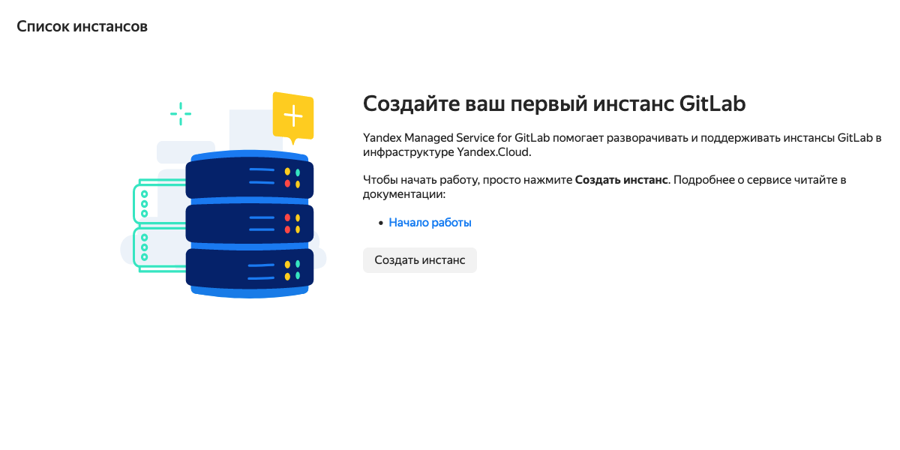

# Создание инфраструктурного стенда

## Создание кластера Kubernetes

**В примере все ресурсы создаются в каталоге default.**

Для работы потребуются установленные
[yc](https://cloud.yandex.ru/docs/cli/operations/install-cli),
[kubectl](https://kubernetes.io/ru/docs/tasks/tools/install-kubectl/),
[helm](https://helm.sh/docs/intro/install/)

Для `yc` необходимо пройти процедуру [создания профиля](https://cloud.yandex.ru/docs/cli/quickstart#initialize)
и авторизоваться.

* Создайте сервисную учетную запись для будущего кластера

```bash
yc iam service-account create mothership-sa
```

* Назначьте права для сервисной учетной записи на каталог default

> Здесь и далее, если название каталога отличается от `default`,
> необходимо его поменять.
> Это же касается имен сетей и подсетей (network и subnet)

```bash
yc resource-manager folder add-access-binding \
  --name=default \
  --service-account-name=mothership-sa \
  --role=editor
```

* Создайте публичный зональный кластер самой свежей версии с именем `mothership`
в зоне доступности `ru-central1-b`

```bash
yc managed-kubernetes cluster create \
  --name=mothership \
  --public-ip \
  --network-name=default \
  --service-account-name=mothership-sa \
  --node-service-account-name=mothership-sa \
  --release-channel=rapid \
  --zone=ru-central1-b \
  --folder-name default
```

* Создайте группу узлов для кластера.
Группа на старте должна состоять из 1 прерываемого хоста c4m8.
Группа должна автоматически расширяться до 4 таких хостов.

> Не забудьте заменить `username`, `ssh pubkey`

```bash
yc managed-kubernetes node-group create \
  --name=mothership-preempt-b \
  --cluster-name=mothership \
  --cores=4 \
  --memory=8G \
  --preemptible \
  --auto-scale=initial=1,min=1,max=4 \
  --network-interface=subnets=default-ru-central1-b,ipv4-address=nat \
  --folder-name default \
  --metadata="ssh-keys=username:ssh-ed25519 AAAA.... username"
```

* Получите kubeconfig с авторизацией

```
yc managed-kubernetes cluster get-credentials --name=mothership --external
```

* Проверяем работоспособность кластера, например:

```
kubectl get nodes
```

## Создание Gitlab

Создание экземпляра managed gitlab производится из вэб-консоли


* Нажмите "Создать инстанс"



* Заполните поля, отмеченные красным маркером


* Нажмите "Создать" и ждите готовности gitlab.

> Когда инстанс будет готов, на почтовый адрес, который был указан в поле
> "электронная почта", придет сообщение "Account was created for you..."

## Установка Gitlab Runner

* Создайте в созданном на предыдущем шаге Gitlab группу `demo`


* В настройках созданной группы выберите раздел `CI/CD` -> `Runners`.
Отсюда нам понадобятся параметры `URL` и `Registration Token`.


* Далее с помощью Helm устанавливаем раннер в наш кластер Kubernetes,
заменяя плейсхолдеры значениями из UI Gitlabа.

```bash
helm repo add gitlab https://charts.gitlab.io
helm install gitlab-runner gitlab/gitlab-runner
  --set gitlabUrl=<Gitlab instance URL> \
  --set runnerRegistrationToken=<Gitlab Registration Token> \
  --set rbac.create=true \
  --namespace gitlab \
  --create-namespace
```

## Создание Container Registry

* Создаем реджистри

```bash
yc container registry create --name demo
```

* Создаем сервисный аккаунт для доступа к реджистри из CI/CD

```bash
yc iam service-account create image-pusher
```

* Назначаем роль для сервис аккаунта с правом на push

```bash
yc container registry add-access-binding <registry id> \
  --service-account-name image-pusher \
  --role container-registry.images.pusher
```
