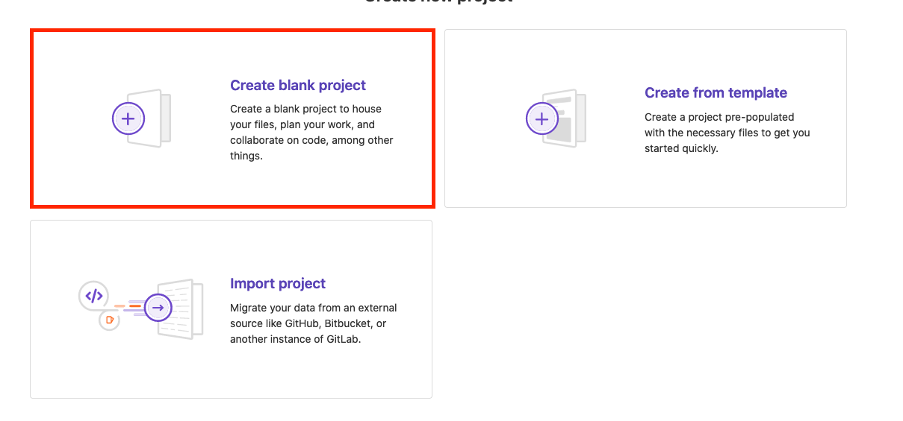
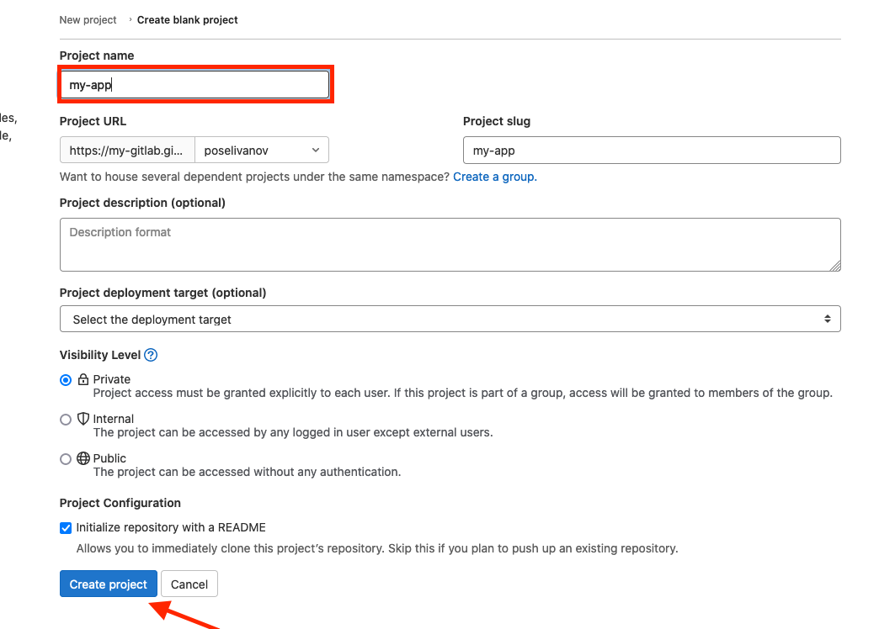
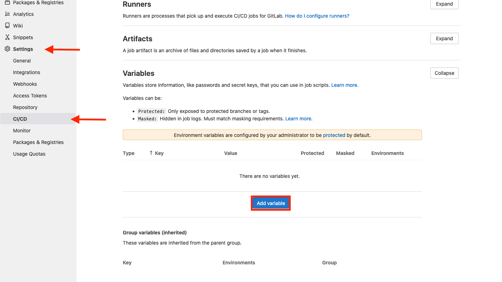
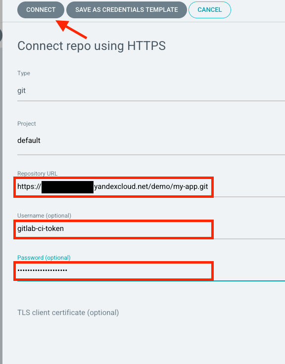

# Argo CD

## Установка Argo CD

Установите [argo-cd](https://argoproj.github.io/cd/) из маркетплейса.

* Для этого перейдите в вэб-консоль, выберите только что созданный кластер Kubernetes
и перейдите в раздел `Marketplace`.

* Выберите продукт ArgoCD.

* Нажмите кнопку Использовать.

* Нажмите кнопку Установить.

* Для получения доступа к UI ArgoCD, подключитесь к кластеру
c помощью механизма port-forwarding

```
kubectl port-forward svc/argo-cd-argocd-server 8443:443
```

После запуска port-forward консоль argocd будет доступна по адресу `https://127.0.0.1:8443`

> Имя пользователя для входа в консоль: admin

> Пароль для первого входа нужно извлечь из secret
> ```
> kubectl get secret argocd-initial-admin-secret \
>  -o jsonpath='{.data.password}' | base64 -d
> ```

## Подготовка репозитория приложения для деплоя

* В созданном в предыдущей инструкции Gitlabе создаем
новый репозиторий в группе `demo`





* Получаем авторизационный ключ для созданного ранее сервис аккаунта

```bash
yc iam key create --service-account-name image-pusher -o key.json
```

* Переходим в настройки созданного проекта и создаем переменные для работы
с Container Registry



| Name | Value | Protected | Masked |
|------|-------|-----------|--------|
| CI_REGISTRY | cr.yandex/\<container registry id\> | `no` | `no` |
| CI_REGISTRY_USER | json_key | `no` | `no` |
| CI_REGISTRY_PASSWORD | <вывод команды `cat key.json \| base64`> | `no` | `yes` |

> key.json - файл полученный на предыдущем шаге создания авторизационного ключа

* Клонируем созданный репозиторий себе

```bash
git clone git@<gitlab host>.gitlab.yandexcloud.net:demo/my-app.git
```

* Копируем в сколонированный репозиторий все файлы из директории
`app/` текущего репозитория

> Обратите внимание, что из указанной директории так же должен быть скопирован
скрытый файл `.gitlab-ci.yml`

* Комитим и пушим изменения

```bash
git add .
git commit -m "Add app src and CI"
git push
```

* Переходим в интерфейс Gitlab и дожидаемся окончания CI пайплайна


## Деплой проекта с помощью Argo CD

### Добавление репозитория

* Переходим в вэб интерфейс Gitlab в свой проект -> Settings -> Access Tokens
и  создаем новый токен с правами `read_repository`


> :warning: **Не закрывайте страницу после создания токена**, на следующем шаге
> он нам понадобится. Достать его значение после закрытия страницы невозможно!

* Переходим в вэб интерфейс Argo CD -> Settings -> Repositories

* Выбираем `Connect repo using HTTPS`

* В поле Repository URL вставляем адрес нашего репозитория из Gitlab

> Заканчивается на `.git`. Можно найти если нажать на кнопку Clone
> на странице проекта (Clone with HTTPS)

В поле Username пишем `gitlab-ci-token`

В поле Password вставляем токен из Gitlab

И нажимаем `Connect`



### Создание приложения

* В интерфейсе Argo CD переходим на вкладку Applications и нажимаем кнопку `Create Application`

* Далее заполняем как на скриншоте


* В разделе Helm указываем в полях image.repository и image.tag параметры
собранного вами образа из шага настройки CI пайплайна в Gitlab

> Найти их можно если открыть успешно завершенный пайплайн в Gitlab.
>
>
>
> До `:` - repository, после - tag.

* Нажимаем `Create` и дожидаемся окончания процесса синхронизации


* Для проверки можно в кластере Kubernetes выполнить команду

```bash
$ kubectl get all -n my-app

NAME                         READY   STATUS    RESTARTS   AGE
pod/my-app-85765bb69-rksn7   1/1     Running   0          78s

NAME             TYPE        CLUSTER-IP      EXTERNAL-IP   PORT(S)   AGE
service/my-app   ClusterIP   10.96.222.120   <none>        80/TCP    80s

NAME                     READY   UP-TO-DATE   AVAILABLE   AGE
deployment.apps/my-app   1/1     1            1           80s

NAME                               DESIRED   CURRENT   READY   AGE
replicaset.apps/my-app-85765bb69   1         1         1       79s
```

## Проверка автоматической синхронизации из репозитория

* Переходим в директорию со своим склонированным проектом

* Открываем файл `.helm/values.yaml` и меняем в нем параметр `replicaCount` на `3`

* Сохраняем, комитим и пушим изменения

```bash
git add .
git commit -m "Increase replica count"
git push
```

* После этого в интерфейсе Argo CD дожидаемся синхронизации приложения

> По умолчанию синхронизация происходит раз в 3 минуты

* После этого можно проверить что в кластере количество подов приложения увеличилось

```bash
kubectl get pod -n my-app
```

## Удаление проекта

Для удаления проекта нажмите кнопку `Delete` в интерфесе Argo CD
