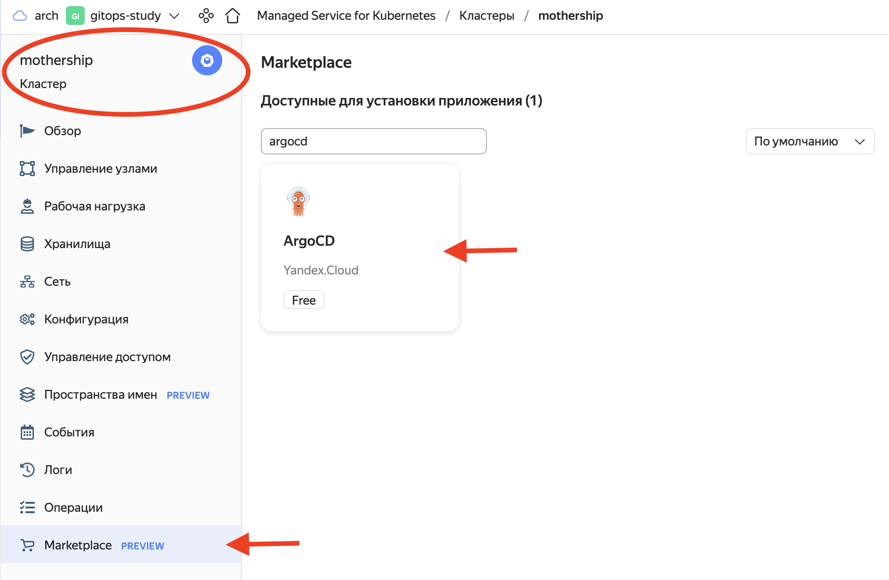

# Установка ArgoCD и Crossplane

## Установка Argo CD

Установите [ArgoCD](https://argoproj.github.io/cd/) из маркетплейса в кластер `mothership`.



* Для этого перейдите в вэб-консоль, выберите созданный на предыдущем шаге кластер Kubernetes
и перейдите в раздел `Marketplace`.

* Выберите продукт ArgoCD.

* Нажмите кнопку Использовать.

* Нажмите кнопку Установить.

* Для получения доступа к UI ArgoCD, подключитесь к кластеру
c помощью механизма port-forwarding

```bash
kubectl port-forward svc/argo-cd-argocd-server 8443:443
```

После запуска port-forward консоль argocd будет доступна по адресу `https://127.0.0.1:8443`

> Имя пользователя для входа в консоль: admin

> Пароль для первого входа нужно извлечь из secret
> ```bash
> kubectl get secret argocd-initial-admin-secret \
>  -o jsonpath='{.data.password}' | base64 -d
> ```

## Установка [Crossplane](https://crossplane.io/) с помощью Helm

> Для выполнения упражнения необходима версия провайдера jet-yc >=v0.1.28 

* Создание namespace для развертывания Crossplane

```bash
kubectl create namespace crossplane-system
```

* Подключение официального репозитория helm-чартов

```bash
helm repo add crossplane-stable https://charts.crossplane.io/stable
```

* Получение последней версии чарта

```bash
helm repo update
```

* Установка Crossplane

```bash
helm -n crossplane-system install crossplane crossplane-stable/crossplane
```

> Для установки провайдера jet-yc необходимо подключить плагин Crossplane для kubectl

* Загрузка и запуск инсталлятора плагина

```bash
curl -sL https://raw.githubusercontent.com/crossplane/crossplane/master/install.sh | sh
```

* Установка плагина в систему

```bash
sudo mv kubectl-crossplane $(dirname $(which kubectl))
```

* Установка провайдера

```bash
kubectl crossplane install provider cr.yandex/crp0kch415f0lke009ft/crossplane/provider-jet-yc:v0.1.28
```

* Для работы Crossplane требуется сервисный аккаунт с правами на создание объектов в облаке. 

> Не забудьте поменять \<FOLDER NAME> и \<CLOUD NAME> на реальные названия каталога и облака

```bash
yc iam service-account create \
  --name crossplane-demo \
  --folder-name <FOLDER NAME>
```

```bash
yc resource-manager cloud add-access-binding \
  <CLOUD NAME> \
  --role admin \
  --service-account-name crossplane-demo
```

* Создание статического ключа для сервисного аккаунта

```bash
yc iam key create --service-account-id crossplane-demo --output key.json
```

* Создание секрета в кластере

```bash
kubectl -n crossplane-system create secret generic yc-creds \
  --from-file=credentials=./key.json
```
