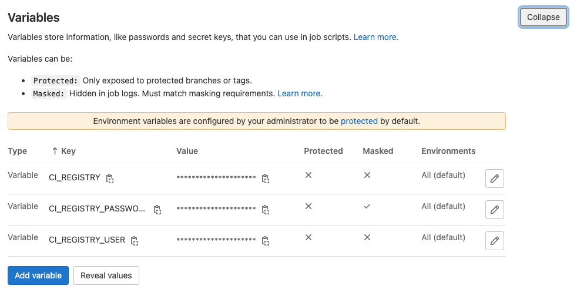

# Динамические стэнды с ArgoCD и Crossplane

## Создание калстера PostgreSQL и эталонной базы данных

* Заполните values.yaml в Helm чарте находящемся по пути `helm-charts/PostgresChart` своими значениями переменных:

** folderID: "xxx"
** subnetId: "xxx"
** networkId: "xxx"

* Установите чарт в кластер Kubernetes

```
helm install -n base \
  --create-namespace \
  base ./helm-charts/PostgresChart
```

* Проверьте в консоли облака, что кластер БД, база данных и пользователь создались


* Добавьте тестовые данные в базу с помощью [SQL queries in the management console](https://cloud.yandex.ru/docs/managed-postgresql/operations/web-sql-query)

```
create table "user"(
    id bigserial primary key,
    first_name varchar(50) not null,
    last_name varchar(50) not null
);

insert into "user"(first_name, last_name) values
    ('Ivan','Ivanov'),
    ('Petr','Petrov'),
    ('Sidr','Sidorov'),
    ('Vasiliy','Pupkin');
```

> Для получения пароля от БД выполните

```
kubectl get secrets -n base pass-base -o jsonpath='{.data.password}' | base64 -d
```

## Подготовка репозиториев

* Создайте репозитории `helm-charts, demo-python-main-service и demo-python-service-one` в гитлабе в рамках группы demo

* Склонируйте их себе и перенестите в них содержимое директорий с соответствующими именами, лежащие рядом с этим ридми

* Создайте токен для подключения к GitLab. Для этого откройте вашу группу `demo`
в GitLab, перейдите в раздел `Settings > Access Tokens` и создайте новый access token:


Значение созданного токена необходимо скопировать в `./gitlab-token.yaml`. Убедитесь, что указан верный `namespace` в манифесте – он должен соответствовать `namespace`-у, в котором установлен ArgoCD. После этого, можно применить манифест через `kubectl apply -f gitlab-token.yaml`.


> После создания токена, необходимо удалить под `argocd-applicationset-controller`, чтобы инициировать его пересоздание.

* Также, необходимо задать переменные окружения для gitlab-runner – необходимо открыть группу `demo` в Gitlab и перейти в раздел `Settings > CI/CD > Variables`. Необходимо указать переменные для подключения к container registry:



Для создания переменных необходимо создать авторизационный ключ для созданного ранее сервис аккаунта

```bash
yc iam key create --service-account-name image-pusher -o key.json
```

| Name | Value | Protected | Masked |
|------|-------|-----------|--------|
| CI_REGISTRY | cr.yandex/\<container registry id\> | `no` | `no` |
| CI_REGISTRY_USER | json_key | `no` | `no` |
| CI_REGISTRY_PASSWORD | <вывод команды `cat key.json \| base64`> | `no` | `yes` |

> key.json - файл полученный на предыдущем шаге создания авторизационного ключа

* Примените в кластер Kubernetes манифест ApplicatioSet

```bash
kubectl apply -f ./demo-python-main-service/merge-applicationset.yaml -n <argo cd namespace>
```

* Создайте в репозитории `demo-python-main-service` две ветки - `feature-1` и `feature-2`

* Дождитесь окончания создания всех ресурсов в ArgoCD

* Проверьте что все работет

```bash
curl demo-main-service-<feature-1/feature-2>.<ingress IP>.nip.io/versions
curl demo-main-service-<feature-1/feature-2>.<ingress IP>.nip.io/users/1
```

## Очистка стэнда

```bash
kubectl delete -f ./demo-python-main-service/merge-applicationset.yaml -n <argo cd namespace>
```
