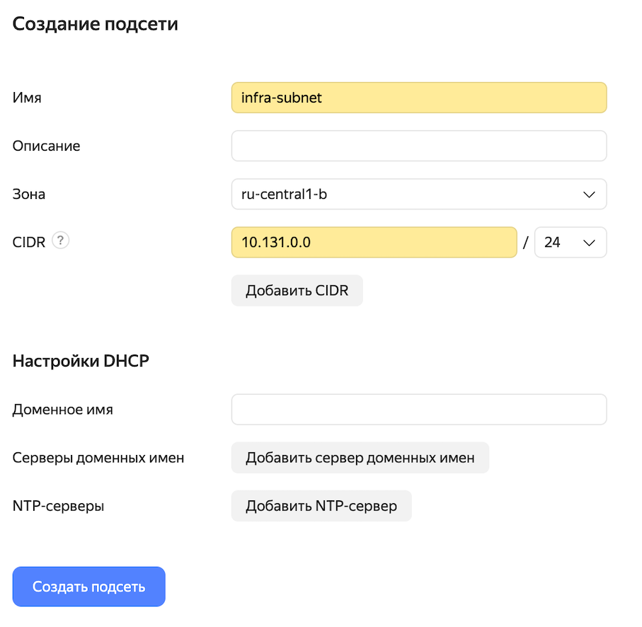
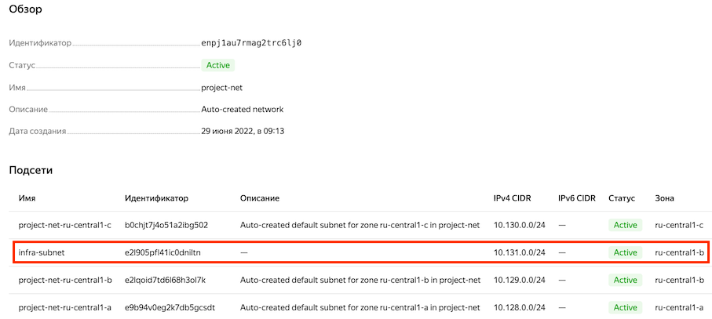

## Практическое задание #1. Работа с облачной консолью Yandex Cloud

Список задач практического задания:
* 1.1 [Вход в облачную консоль Yandex Cloud](#h1-1)
* 1.2 [Создание виртуальной облачной сети (VPC)](#h1-2)
* 1.3 [Резервирование публичного IP-адреса](#h1-3)
* 1.4 [Создание сервисного аккаунта (SA)](#h1-4)
* 1.5 [Создание виртуальной машины (ВМ)](#h1-5)
* 1.6 [Подключение к ВМ по протоколу SSH](#h1-6)


### 1.1 Вход в облачную консоль Yandex Cloud <a id="h1-1"/></a>
Открыть в браузере адрес облачной консоли Yandex Cloud [https://console.cloud.yandex.ru](https://console.cloud.yandex.ru)

`Внимание!` Если вы ранее уже заходили в облачную консоль Yandex Cloud, и она показывается вам снова, то необходимо из неё выйти, нажав на значок `"Учётная запись"` в левом нижнем углу экрана и выбрать `"Выйти"`, перед тем как продолжить.

Нажать на синюю кнопку `"Войти в Яндекс ID"`


Ввести имя пользователя в формате e-mail адреса, которое вы получили перед началом практикума, в поле `"Логин или email"` и нажать на кнопку `Войти`.


Ввести пароль пользователя, который вы получили перед началом практикума, в поле `"Введите пароль"` и нажать на кнопку `Войти`.


Принять условия пользовательского соглашения Яндекса и согласиться на обработку своих персональных данных, нажав на кнопку `"Завершить регистрацию"`.


Нажать на кнопку `"Войти"`. В случае возникновения сообщения об ошибке после нажатия на кнопку, обновите страницу в браузере.


При получении уведомления от облачной консоли с предложением протестировать облачный сервис, выбрать `"Пропустить"` в появившемся окне с уведомлением.


`Поздравляем! Теперь вы можете пользоваться Yandex Cloud!`


### 1.2 Создание виртуальной облачной сети (VPC) <a id="h1-2"/></a>

Перейти в дашборд облачного каталога (значок домика). Для этого в левой части экрана выбрать имя каталога. Имя каталога будет совпадать с первой частью имени пользователя, которое использовалось для входа в облачную консоль. В списке сервисов выбрать `"Virtual Private Cloud"`.


Нажать на кнопку `"Создать сеть"`, после чего заполнить открывшуюся форму с параметрами виртуальной сети в которой указать имя сети, например `"project-net"`, убедиться что опция `"Создать подсети"` выбрана (стоит галочка) и нажать на кнопку `"Создать сеть"`. Описание сети вводить не требуется, но рекомендуется для целей документирования.

Виртуальная сеть VPC существует на уровне облачного каталога, поэтому допускается использование одинаковых имен сетей в разных каталогах.


Убедиться в том, что виртуальная сеть в каталоге успешно создана.


Перейти в настройки виртуальной сети и увидеть, что кроме сети были созданы 3 подсети (по одной подсети для каждой зоны доступности).

Добавить дополнительную подсеть, в которой будет создаваться ВМ, для этого нужно нажать кнопку `Добавить подсеть` в верхней правой части экрана. В открывшейся форме `Создание подсети` заполнить поля ввода следующим образом:
* Имя: `infra-subnet`
* Зона: `ru-central1-b`
* CIDR: `10.131.0.0` и выбрать `/24` в выпадающем списке

Нажать на кнопку `Создать подсеть`



Убедиться в том, что подсеть появилась с списке подсетей.




### 1.3 Резервирование публичного IP-адреса <a id="h1-3"/></a>

Перейти в дашборд облачного каталога (значок домика). Выбрать сервис `"Virtual Private Cloud"` далее выбрать только что созданную сеть и в меню слева выбрать значок `"IP-адреса"`.


На открывшейся странице нажать на кнопку `"Зарезервировать адрес"`, выбрать зону доступности `"ru-central1-b"` и нажать на кнопку `"Зарезервировать"`. Убедиться, что публичный IP адрес в выбранной зоне доступности зарезервировался.


### 1.4 Создание сервисного аккаунта (SA) <a id="h1-4"/></a>

Перейти в дашборд облачного каталога. 


Выбрать в верхнем меню `"Сервисные аккаунты"` и нажать на кнопку `"Создать сервисный аккаунт"`.


Заполнить поля формы `"Создание сервисного аккаунта"` следующим образом:
* Имя: `user-<3-цифры>-sa`, где <3-цифры>, цифровая часть логина пользователя, например, `750`. Сервисные аккаунты (SA) создаются на уровне облака, а не облачного каталога, поэтому их имена не должны повторяться в границах всего облака. Для обеспечения уникальности имени SA используется цифровая часть логина пользователя.
* Описание: краткое описание полномочий данного SA, например, `"SA для практикума"`.
* Роли в каталоге: нажать на значок плюса `"Добавить роль"` и выбрать `"admin"` в выпадающем списке.

нажать на кнопку `"Создать"`.


Убедиться в том, что сервисный аккаунт (SA) успешно создан. 


`Важно!` Если вы попытаетесь создать SA с именем, которое уже есть в облаке, вы получите сообщение об ошибке.


### 1.5 Создание виртуальной машины (ВМ) <a id="h1-5"/></a>

Перейти в дашборд облачного каталога. В списке сервисов выбрать `"Compute Cloud"`.


На открывшейся странице нажать кнопку `"Создать ВМ"` и заполнить параметры виртуальной машины (ВМ):

* Имя: `infra-vm`
* Зона доступности: `ru-central1-b`
* Выбор образа/загрузочного диска: `Cloud Marketplace > Посмотреть больше`. В поле ввода "Поиск инструментов" ввести `toolbox` и выбрать продукт `Yandex Cloud Toolbox`. В открывшемся окне с описанием продукта нажать кнопку `Использовать`.
* vCPU: `2`
* RAM: `4 Гб`
* Подсеть: `project-net / infra-subnet`
* Публичный адрес: `Список`
* IP-адрес: в этом поле должен показываться IP-адрес, зарезервированный ранее 
* Сервисный аккаунт: `user-<3-цифры>-sa` - имя сервисного аккаунта, созданного ранее
* Логин: `admin` - имя пользователя, который будет использоваться для подключения к ВМ по протоколу SSH
* SSH-ключ: Открытый ключ SSH (public SSH key), который будет загружен на ВМ при её созданиии и будет использоваться для аутентификации пользователя, имя которого задано параметром `Логин`. Должен быть сгенерирован перед началом практикума. Подробная инструкцию по генерации и использованию SSH ключей в Yandex Cloud [здесь](https://cloud.yandex.ru/docs/managed-kubernetes/operations/node-connect-ssh). 

`Важно!` При заполнении поля `SSH-ключ` после строки ключа необходимо добавить пустую строку (нажать Enter).

после заполнения параметров нажать на кнопку `"Создать ВМ"`.

Убедиться в успешном создании виртуальной машины.


### 1.6 Подключение к ВМ по протоколу SSH <a id="h1-6"/></a>

[Инструкции по подключению к ВМ в Yandex Cloud по протоколу SSH](https://cloud.yandex.ru/docs/managed-kubernetes/operations/node-connect-ssh).

Подключиться к созданной ВМ по протоколу SSH:
```bash
ssh admin@<зарезервированный-ip-адрес>
```

Вывод терминала после подключения к ВМ будет примерно такой:
```
Warning: Permanently added '130.193.42.209' (ED25519) to the list of known hosts.
Welcome to Ubuntu 20.04.4 LTS (GNU/Linux 5.4.0-120-generic x86_64)

 * Documentation:  https://help.ubuntu.com
 * Management:     https://landscape.canonical.com
 * Support:        https://ubuntu.com/advantage

The programs included with the Ubuntu system are free software;
the exact distribution terms for each program are described in the
individual files in /usr/share/doc/*/copyright.

Ubuntu comes with ABSOLUTELY NO WARRANTY, to the extent permitted by
applicable law.

To run a command as administrator (user "root"), use "sudo <command>".
See "man sudo_root" for details.

admin@infra-vm:~$
```

`Поздравляем! Вы успешно справились с заданием!`

### [<< оглавление](../README.md) || [задание 2 >>](../lab-02-yc/README.md)
