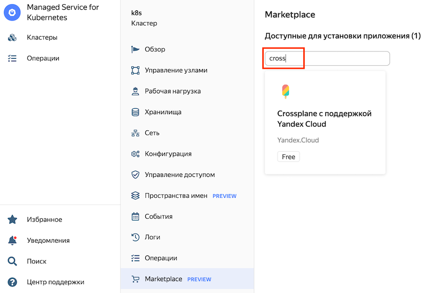
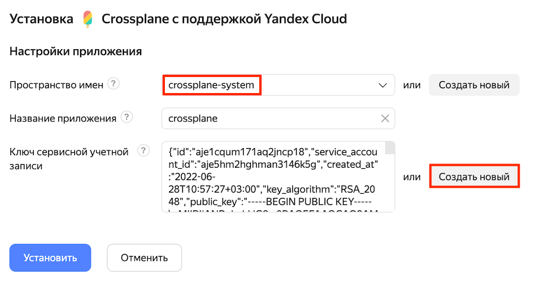

## Практическое задание #4. Работа с Crossplane

Список задач практического задания:
* 4.1 [Подготовка к развёртыванию Crossplane](#h4-1)
* 4.2 [Установка Crossplane в кластер Kubernetes](#h4-2)
* 4.3 [Развёртывание ВМ с веб-сервером](#h4-3)
* 4.4 [Удаление ВМ](#h4-4)


### 4.1 Подготовка к развёртывания Crossplane <a id="h4-1"/></a>

Подготовить входные данные для развёртывания:
```bash
cd ~/labs/lab-04-crossplane

export ZONE_ID="ru-central1-b"
export VM_NAME="crossplane-vm"
export SUBNET_NAME=$NET_NAME-$ZONE_ID
export NET_NAME=$(yc vpc network list --limit=1 --format=json | jq -r .[0].name)
export META_IP=$(curl -s http://169.254.169.254/latest/meta-data/local-ipv4)
export SUBNET_ID=$(yc vpc subnet get --name=$SUBNET_NAME --format=json | jq -r .id)
export NET_ID=$(yc vpc subnet get $SUBNET_ID --format=json | jq -r .network_id)
export SUBNET_PREFIX=$(yc vpc subnet get $SUBNET_ID --format=json | jq -r .v4_cidr_blocks[0])
export FOLDER_ID=$(yc config get folder-id)
export IMAGE_ID=$(yc compute image get --folder-id standard-images --name=lemp-v20220606 --format=json | jq -r .id)
```

Включить NAT на ВМ `infra-vm` для подсети, в которой находятся worker nodes кластера Kubernetes:
```bash
sudo sysctl -w net.ipv4.ip_forward=1
sudo iptables -A FORWARD -i eth0 -j ACCEPT
sudo iptables -A FORWARD -o eth0 -j ACCEPT
sudo iptables -t nat -A POSTROUTING -o eth0 -s $SUBNET_PREFIX -j MASQUERADE

```

Создать таблицу маршрутизации для передачи всего трафика в Интернет от worker nodes кластера Kubernetes через ВМ `infra-vm`:
```bash
yc vpc route-table create --name=default-via-infra-vm --network-name=$NET_NAME --route destination=0.0.0.0/0,next-hop=$META_IP
```

Привязать созданную таблицу маршрутизации к подсети в которой находятся worker nodes кластера Kubernetes:
```bash
yc vpc subnet update --name=$SUBNET_NAME --route-table-name=default-via-infra-vm
```

Создать пространства имен (`namespace`) для Crossplane в кластере Kubernetes:

```bash
k create ns crossplane-system
```


### 4.2 Установка Crossplane в кластер Kubernetes <a id="h4-2"/></a>

В [облачной консоли](https://console.cloud.yandex.ru) перейти в дашборд каталога. Далее в списке сервисов выбрать `"Managed Service for Kubernetes > Кластеры > k8s"` и открыть конфигурацию развёрнутого в предыдущем задании кластера Kubernetes.

В меню слева выбрать `Marketplace` и в поле ввода `"Доступные для установки приложения"` написать `cross`, после чего выбрать приложение `"Crossplane с поддержкой Yandex Cloud"`. Далее нажать на кнопку `"Использовать"`.



В открывшейся форме `"Настройки приложения"`:
* выбрать в списке пространство имен `crossplane-system`
* Нажать на кнопку `"Создать новый"` для создания нового ключа к существующему сервисному аккаунту `user-<3-цифры>-sa`

После заполнения всех полей формы необходимо нажать на кнопку `"Установить"`. 



Дождаться пока Crossplane перейдёт в состояние `Deployed`.


Применить в кластер Kubernetes манифест Crossplane `ProviderConfig`:
```bash
kubectl apply -f providerconfig.yml
```


### 4.3 Развёртывание ВМ с веб-сервером <a id="h4-3"/></a>

Заполнить шаблон манифеста crossplane для создания ВМ нужными значениями из исходных данных
```bash
envsubst < vm-inst-tmpl.yml > vm-instance.yml
```

Проверить полученный манифест для создания ВМ перед его применением
```
cat vm-instance.yml
```

Привязать созданную таблицу маршрутизации к подсети в которой находятся worker nodes кластера Kubernetes:
```bash
yc vpc subnet update --name=$SUBNET_NAME --route-table-name=default-via-infra-vm
```

Создать ВМ с веб-сервером из подготовленного манифеста ВМ
```bash
k apply -f vm-instance.yml
```

Проверить состояния созданных в кластере Kubernetes объектов под управлением Crossplane
```
k get network
k get subnet
k get instance
yc compute instance list
```

Проверить работоспособность развёрнутой ВМ:
```bash
LEMP_IP=$(yc compute instance get --name=$VM_NAME --format=json | jq -r .network_interfaces[0].primary_v4_address.address)

ping -c 3 $LEMP_IP
curl http://$LEMP_IP
```

### 4.3 Удаление ВМ с веб-сервером <a id="h4-3"/></a>

Удалить ВМ с помощью Crossplane
```bash
k delete instance $VM_NAME
```

Убдедиться, что ВМ удалена
```bash
k get instance
yc compute instance list
```

`Поздравляем! Вы успешно справились с заданием!`

### [ << задание 3 ](../lab-03-terraform/README.md) || [задание 5 >>](../lab-05-pulumi/README.md)
### [ << оглавление ](../README.md)
