# Создание графических схем для Terraform развёртываний с помощью инструмента Draw.io на примере Yandex Cloud.


## Оглавление
* [Основные понятия и определения](#terms)
* [Какую задачу решаем](#target)
* [Методика - порядок действий](#process)
* [Практический пример - развёртывание ВМ в Yandex Cloud:](#ex)
  1. [Загрузить пример развёртывания из репозитория на github](#ex-1)
  2. [Подготовить Terraform развёртывание](#ex-2)
  3. [Подготовить данные в Terraform для графического шаблона (drawio.tf)](#ex-3)
  4. [Подготовить (нарисовать) графический параметризованный шаблон развёртывания в Draw.io](#ex-4)
  5. [Интегрировать Terraform развёртывание с графическим шаблоном Draw.io](#ex-5)
  6. [Выполнить Terraform развёртывание](#ex-6)
  7. [Получить результат - графическое представление развёртывания в формате Draw.io](#ex-7)
  8. [Опционально. Проверить работу атрибутов объектов в графическом шаблоне](#ex-8)


## Основные понятия и определения <a id="terms"/></a>
* [Draw.io](https://app.diagrams.net/) - инструмент для рисования схем.
* `Terraform развёртывание` - набор .tf файлов, которые определяют целевое состояние развёртываемой системы
* `Атрибуты объектов` - описание переменных для соответствующих объектов в файле [variables.tf](./variables.tf)
* `Графическое представление развёртывания` или `графический шаблон` - графическая параметризованная схема в формате Draw.io. Параметризация заключается в создании для графических объектов в Draw.io специальных атрибутов (переменных).


## Какую задачу решаем <a id="target"/></a>
В настоящее время [Terraform](https://terraform.io) является самым известным инструментом для работы с инфраструктурой как с кодом `"Infrastructure as a Code" (IAC)`.

Типовое развёртывание с помощью Terraform (`Terraform deployment`) обычно состоит из нескольких файлов с расширением `.tf`. Каждый такой файл может описывать свою часть целевого состояния системы, например:
  * [providers.tf](./providers.tf) - используемые TF-провайдеры и параметры для них
  * [variables.tf](./variables.tf) - описание входных переменных для развёртывания
  * [compute.tf](./compute.tf) - описание ресурсов сервиса compute
  * `vpc.tf` - описание сетевых ресурсов
  * и т.д.

Степень и структура распределения TF-ресурсов по разным файлам зависит от проекта, здесь нет какого-то одного правильного пути.
Можно описать весь проект в одном единственном большом .tf файле, например, `main.tf`, но управлять таким большими развёртыванием скорее всего будет сложно.

В результате выполнения Terraform развёртывания в инфраструктуре создаются ресурсы (объекты). 
С помощью Terraform CLI можно посмотреть на перечень созданных ресурсов и оценить их состояние (`Terraform state`), однако, в Terraform отсутствуют встроенные инструменты для наглядного графического отображения структуры созданных ресурсов.

Как правило, Terraform развёртывания статичны, то есть, при выполнении команды `terraform apply` всегда создаётся строго определенный набор объектов. Два разных развёртывания одного типа скорее всего будут отличаться друг от друга лишь значениями атрибутов создаваемых объектов - значениями переменных в файле [variables.tf](./variables.tf). 

Для решения задачи создания графического изображения одной и той же структуры объектов с разными значениями атрибутов (параметров) можно создать обобщённое графическое представление (шаблон), в котором изобразить все элементы структуры развёртывания данного типа (ресурсы и связи между ними) и передавать в этот шаблон значения атрибутов переменных, которые определяют конкретное развёртывание. В подобной логике работают многие известные шаблонизаторы в языках программирования, например, [Jinja](https://jinja.palletsprojects.com/) или [Go Template](https://pkg.go.dev/text/template)

В нашем случае значения атрибутов (переменных) в такой графический шаблон будут передаваться из файла [variables.tf](./variables.tf). По завершении развёртывания (`terraform apply`) будет сгенерирована графическая схема в формате Draw.io для выполненного развёртывания со значениями атрибутов, которые были заданы в файле `variables.tf`.


## Методика - порядок действий <a id="process"/></a>
Для реализации описанного выше подхода по созданию графического представления TF-развёртывания необходимо выполнить следующие действия:
  1. Подготовить Terraform развёртывание (набор .tf файлов) в котором параметризовать все необходимые атрибуты TF-ресурсов в файле `variables.tf`.
  2. Подготовить данные в Terraform для графического шаблона.
  3. Подготовить (нарисовать) параметризованный графический шаблон развёртывания в Draw.io.
  4. Интегрировать Terraform развёртывание с графическим шаблоном Draw.io.
  5. Выполнить Terraform развёртывание.
  6. Получить результат - графическое представление развёртывания в формате Draw.io.


## Практический пример - развёртывание ВМ в Yandex Cloud <a id="ex"/></a>
Рассмотрим применение вышеописанной методологии на примере создания виртуальной машины (ВМ) в Yandex Cloud.

Список атрибутов (переменных), которые будут использоваться при развёртывании:
  * `cloud_id` - идентификатор облака, в котором будет создаваться ВМ
  * `folder_id` - идентификатор каталога, в котором будет создаваться ВМ
  * `image_family` - семейство образов из которого будет создаваться ВМ
  * `net_name` - идентификатор облачной сети, в которой будет создаваться ВМ
  * `subnet_name` - идентификатор облачной подсети, в которой будет создаваться ВМ

Список атрибутов, которые будем использовать по результатам развёртывания:
  * `vm_priv_ip` - приватный IP адрес, который будет выделен ВМ при её создании
  * `vm_pub_ip` - публичный IP адрес, который будет выделен ВМ при её создании

Предполагается, что все ресурсы (net,subnet,image) уже созданы до начала выполнения данного развёртывания.

### 1. Загрузить пример развёртывания из репозитория на github  <a id="ex-1"/></a>
  ```bash
  curl -s https://raw.githubusercontent.com/yandex-cloud/yc-architect-solution-library/master/drawio-tf-tutorial/install.sh | bash
  ```

### 2. Подготовить Terraform развёртывание <a id="ex-2"/></a>
  * [variables.tf](./variables.tf)
  * [providers.tf](./providers.tf)
  * [compute.tf](./compute.tf)

Инициализировать Terraform и проверить развёртывание на отсутствие ошибок
```bash
cd drawio-tf-example
source env-yc.sh
terraform init
terraform plan
```

### 3. Подготовить данные в Terraform для графического шаблона (drawio.tf) <a id="ex-3"/></a>
Для использования атрибутов объектов в графическом шаблоне необходимо сначала подготовить их на стороне Terraform. Делается это с помощью использования конструкции Terraform [locals](https://developer.hashicorp.com/terraform/language/values/locals).

В TF развёртывании создаётся специальный файл [drawio.tf](./drawio.tf) в котором описывается набор атрибутов (параметров), значения которых будут передаваться в графический шаблон. Здесь мы определяем соответствие между названием атрибута и его реальным значением из TF развёртывания.

При выполнении TF-кода в `drawio.tf` передаются следующие параметры: 
  * имя файла с графическим шаблоном развёртывания - значение переменной `draw_template_name` 
  * имя файла в котором будет сохраняться сгенерированная в TF диаграмма развёртывания в формате Draw.io - значение переменной `draw_name`.

В результате все нужные для графического шаблона данные собираются на стороне TF в переменной `TF_DRAW_DATA`.

Все вышеперечисленные параметры передаются на стороне Terraform в функцию [templatefile](https://developer.hashicorp.com/terraform/language/functions/templatefile) в которой и выполняется вставка подготовленных данных из переменной `TF_RAW_DATA` в подготовленный графический шаблон (*rendering*).

Остаётся лишь указать место на диаграмме где нужно использовать тот или иной атрибут. Подробнее об этом в [разделе 5](#ex-5).


### 4. Подготовить (нарисовать) графический параметризованный шаблон развёртывания в Draw.io <a id="ex-4"/></a>
Перейти на сайт [Draw.io](https://app.diagrams.net) и нажать на кнопку "`Cоздать новую диаграмму`".

<p align="left">
    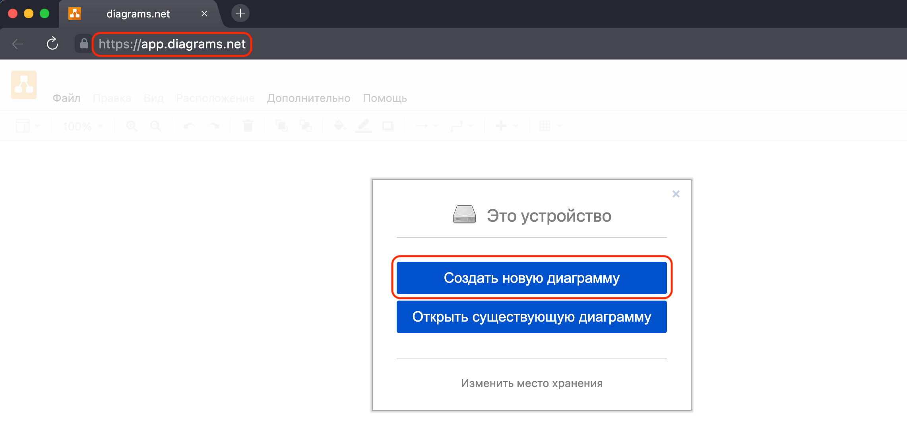
</p>

При необходимости можно загрузить offline версию `Draw.io` для нужной платформы к себе на компьютер
по [ссылке](https://github.com/jgraph/drawio-desktop/releases).

Задать имя файла для диаграммы, её тип - `XML` и нажать на кнопку "`Сохранить`".

<p align="left">
    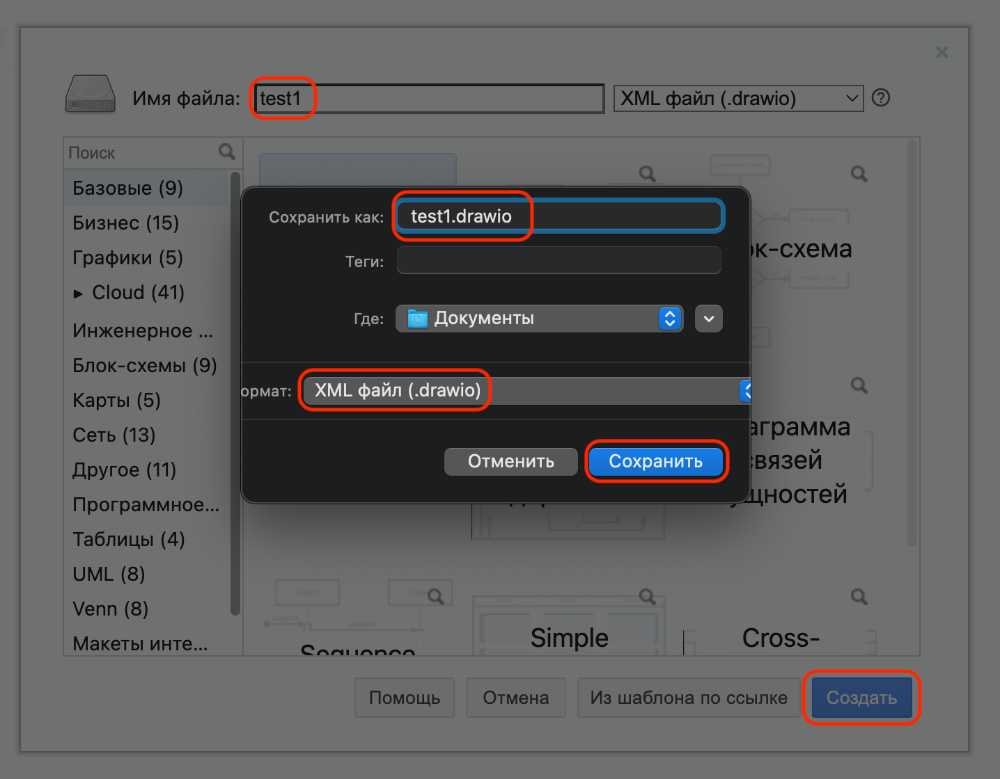
</p>

В меню выбрать "`Файл -> Свойства`"

<p align="left">
    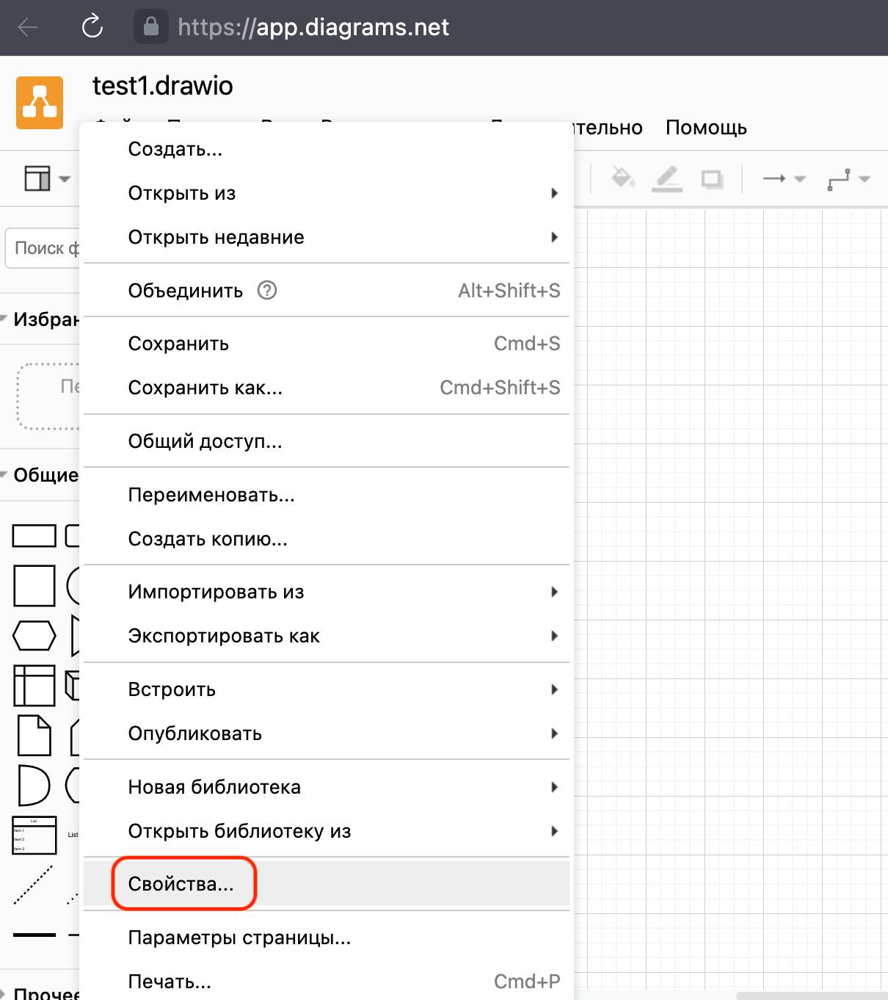
</p>

В открывшейся форме отключить параметр "`Сжато`" (снять галочку), после чего нажать на кнопку "`Применить`". Это укажет Draw.io сохранять файлы в обычном текстовом (XML) виде без использовании ZIP сжатия.

<p align="left">
    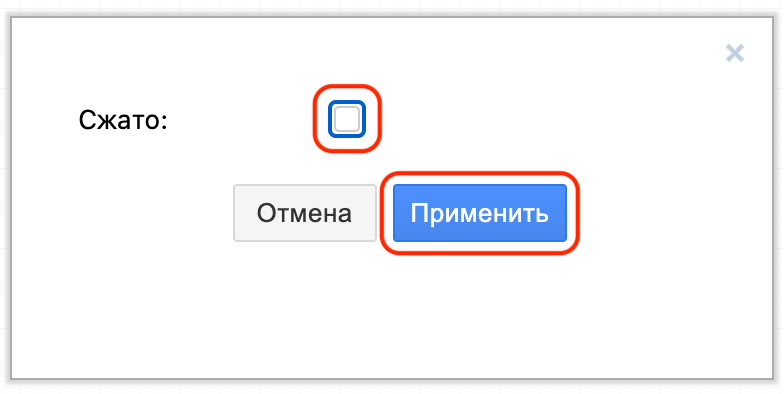
</p>

Нарисовать с помощью геометрических примитивов нужную нам схему. В примере ниже нарисован  прямоугольник со скруглёнными краями, который будет обозначать у нас облако в Yandex Cloud.

Для добавления на схему значений атрибутов (параметров) для облака нужно выбрать в верхнем меню знак "`+ (плюс)`" и выбрать в выпадающем меню пункт "`Текст`".

<p align="left">
    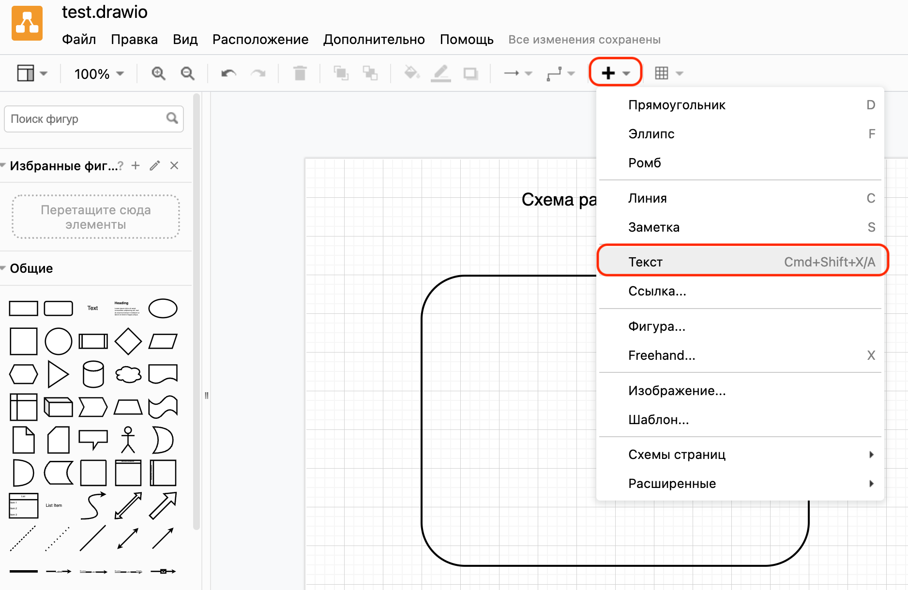
</p>

В области диаграммы синим пунктиром выделится область экрана со значением Text в которую нужно ввести текст. Текст атрибутов объекта можно вводить в формате `[Метка] <%имя-переменной%>`, где 
  * `метка` - любой поясняющий текст. Использование меток опционально (можно не использовать).
  * `%имя-атрибута%` - это имя переменной, определённой в конструкции `locals` файла [drawio.tf](./drawio.tf). Имя переменной всегда должно обрамляться с двух сторон символом `%` (процент).

В примере ниже метка это текст "`cloud = `", а имя переменной это текст между символами процента, то есть "`cloud_id`".

<p align="left">
    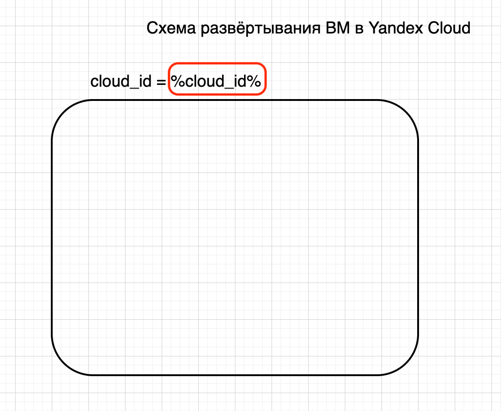
</p>

Выбираем объект с ранее написанным текстом "`cloud id = %cloud_id%`", нажимаем правую кнопку мыши, и в открывшемся контекстном меню выбираем "`Редактировать данные`". Для быстрого перехода в этот режим можно также использовать горячие клавиши `Cmd+M/Ctrl+M`.

<p align="left">
    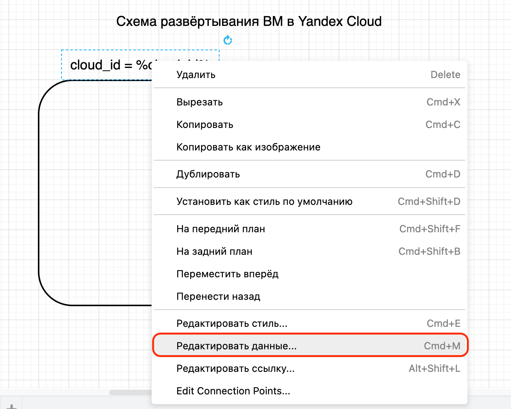
</p>

В открывшейся форме внизу нужно поставить галочку в параметре "`Плейсхолдеры (Placeholders)`" и нажать на кнопку "`Применить`".

<p align="left">
    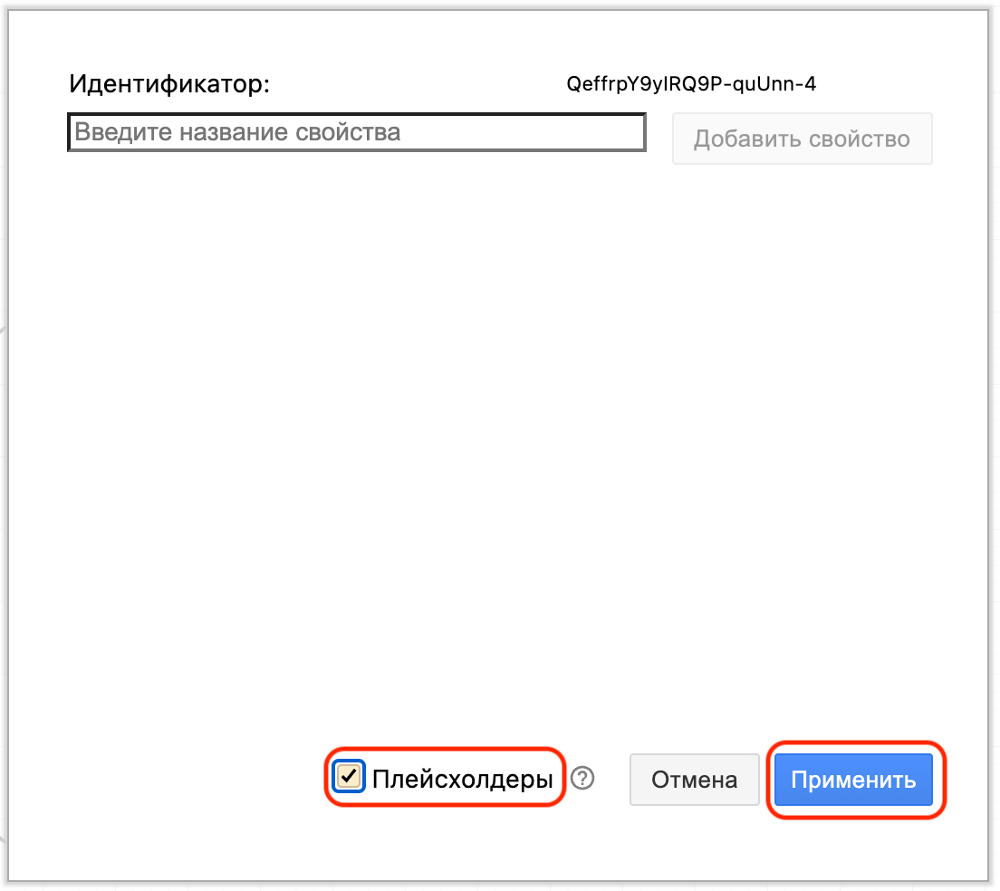
</p>

В результате объект облако с атрибутом "`cloud_id`" может выглядеть так:

<p align="left">
    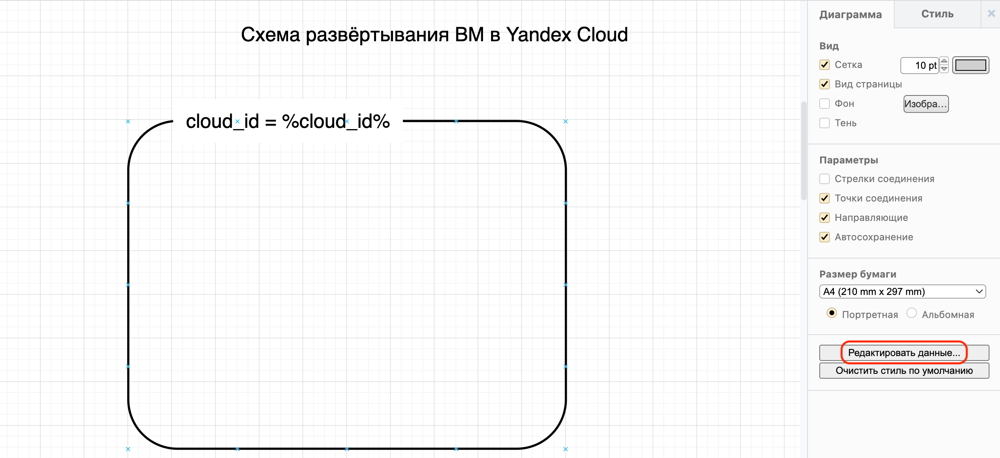
</p>

Продолжим рисовать нужную нам графическую структуру Terraform развёртывания на диаграмме и добавлять новые атрибуты объектов. Стоит отметить, что атрибуты объектов всегда следует добавлять на уровне области листа рисования, а не на уровне отдельного объекта на листе. Это позволяет Draw.IO хранить атрибуты всех объектов в одном месте. Результат рисования может выглядеть, например, так:

<p align="left">
    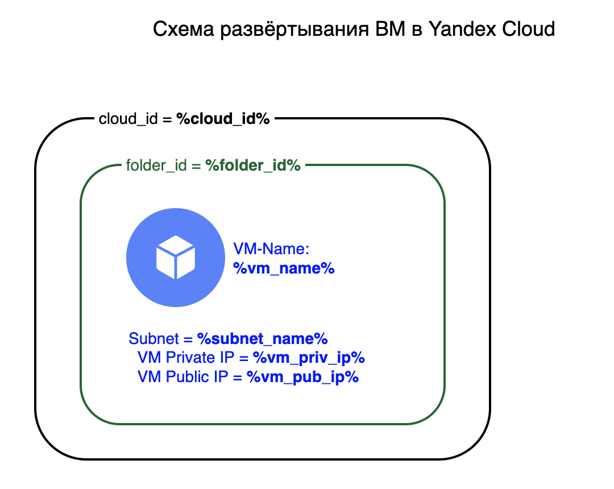
</p>

На схеме мы видим следующие объекты и их атрибуты:
  * `Cloud` с атрибутом `cloud_id`
  * `Folder` с атрибутом `folder_id`
  * `VM` с атрибутами: 
    - `vm_name` - имя виртуальной машины (ВМ)
    - `subnet_name` - название подсети к которой подключится ВМ при создании
    - `vm_priv_name` - приватный IP адрес, который выделится ВМ при создании
    - `vm_pub_name` - публичный IP адрес, который выделится ВМ при создании


### 5. Интегрировать Terraform развёртывание с графическим шаблоном Draw.io <a id="ex-5"/></a>
После создания графического шаблона необходимо выполнить его интеграцию с Terraform развёртыванием. Для этого в нужном месте XML файла шаблона нужно добавить ссылку на переменную `TF_RAW_DATA`.

Для внесения изменений нужно открыть файл с шаблоном в любом текстовом редакторе, и выполнить операцию поиска и замены:
  * Ищем строку `<object label="" id="0">`
  * Заменяем на строку `<object label="" ${TF_DRAW_DATA} id="0">`

исходное состояние файла с шаблоном до выполнения операции замены:
<p align="left">
    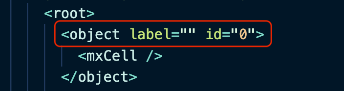
</p>

целевое состояние файла с шаблоном после выполнения операции замены:
<p align="left">
    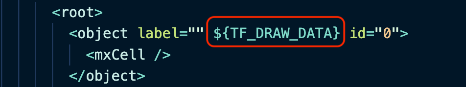
</p>

После внесения изменений в файл с графическим шаблоном его уже невозможно будет открыть в Draw.io напрямую, поэтому рекомендуется поменять расширение у файла с графическим шаблоном с `.drawio` на `.tpl`.

#### Редактирование файла с шаблоном в Draw.IO
Если в будущем потребуется редактировать файл с шаблоном в Draw.IO, файл с шаблоном следует предварительно к этому подготовить. Для подготовки нужно открыть файл с шаблоном (.tpl) в обычном текстовом редакторе и удалить в нём строку "`${TF_DRAW_DATA}`", после чего сохранить изменения. После этих действий файл с шаблоном будет нормально (без ошибок) открываться в Draw.IO. Перед использованием уже измененного шаблона в Terraform развёртывании, необходимо строку "`${TF_DRAW_DATA}`" вернуть обратно в файл.


### 6. Выполнить Terraform развёртывание <a id="ex-6"/></a>
```bash
source env-yc.sh
terraform apply
```

### 7. Получить результат - графическое представление развёртывания в формате `Draw.io` <a id="ex-7"/></a>
Схема может выглядеть так:

<p align="left">
    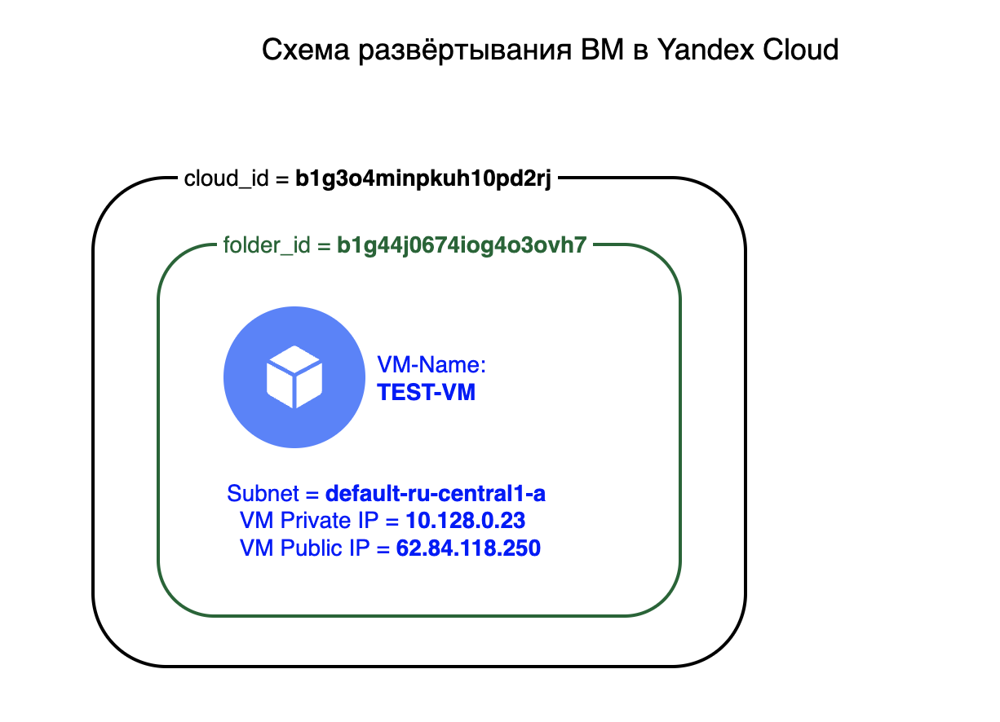
</p>

Набор атрибутов в схеме можно посмотреть перейдя в режим `"Редактировать данные"` через меню или с использованием горячих клавиш.

<p align="left">
    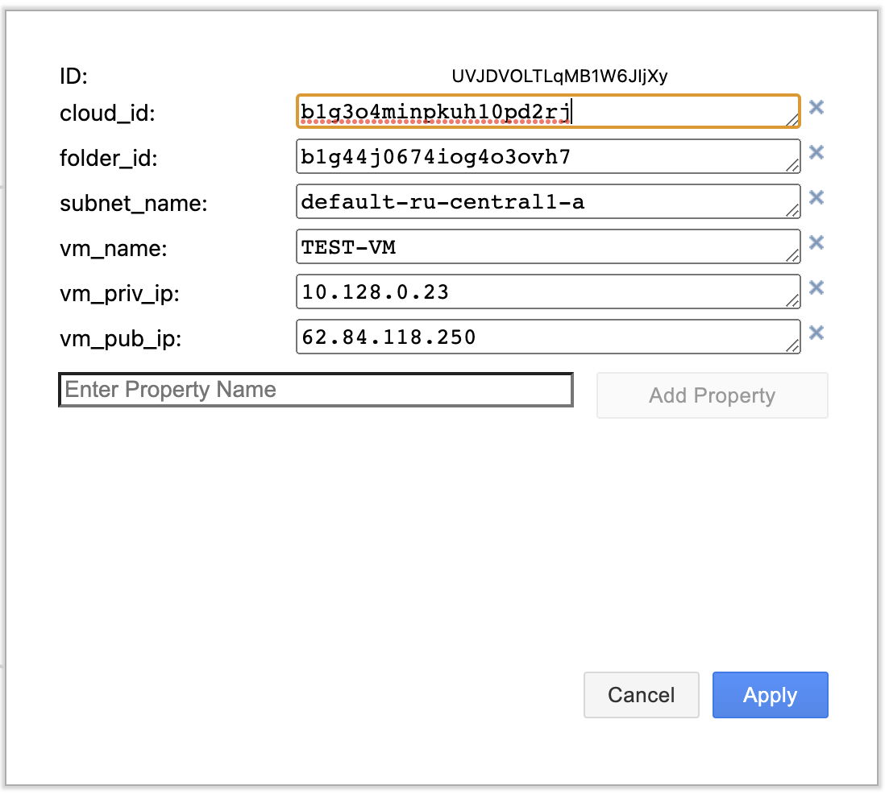
</p>

При установленном локально Draw.io можно преобразовать схему из формата .drawio в другие форматы, например:
  * pdf - `draw --export --format pdf test-vm.drawio`
  * png - `draw --export --format png test-vm.drawio`

При использовании [on-line версии Draw.io](https://app.diagrams.net/) возможно воспользоваться функциями экспорта, выбрав в основном меню программы пункт `Файл -> Экспортировать как`.


### 8. Опционально. Проверить работу атрибутов объектов в графическом шаблоне <a id="ex-8"/></a>
При необходимости можно проверить работу созданных атрибутов объектов в графическом шаблоне.

Для этого нужно перейти в область листа рисования - указать мышью в любую `свободную область` на листе рисования и перейти в режим `Редактировать данные` через меню или с использованием горячих клавиш.

В открывшейся форме ввода ввести название атрибута (переменной) и нажать на кнопку `"Добавить свойство"`

<p align="left">
    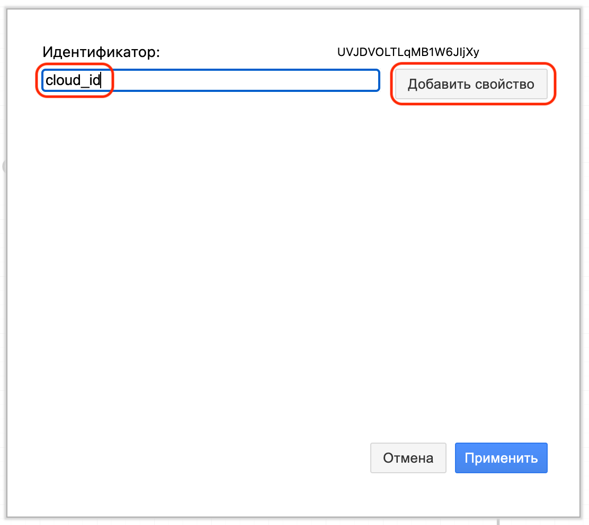
</p>

Задать значение для атрибута и нажать на кнопку `"Применить"`

<p align="left">
    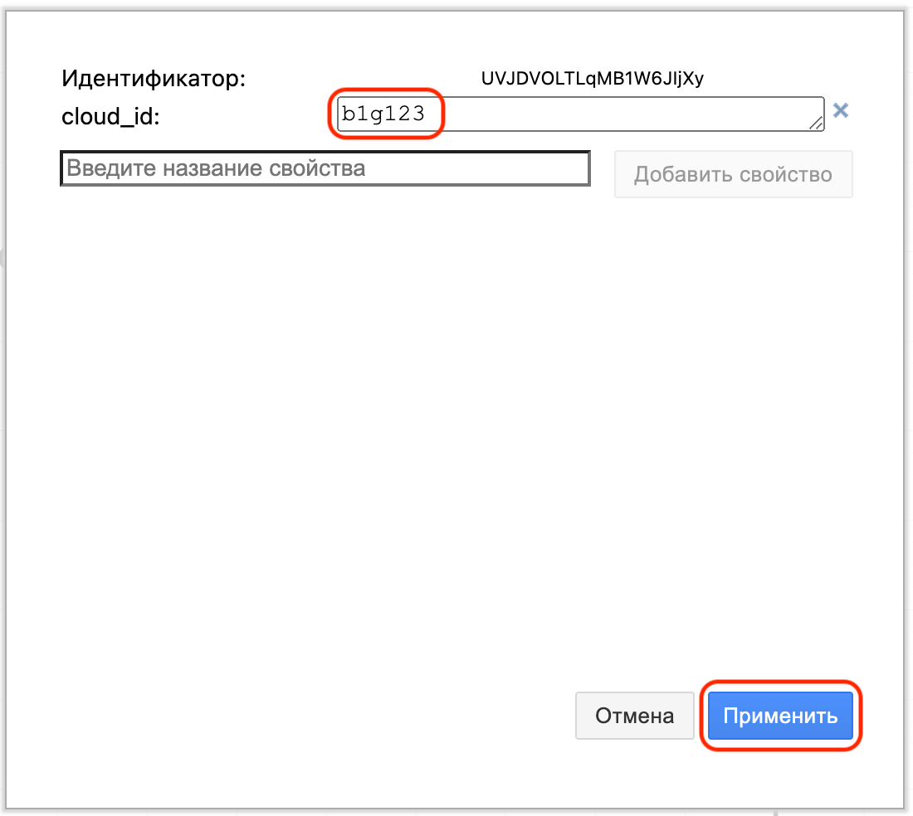
</p>

Результат может выглядеть так:

<p align="left">
    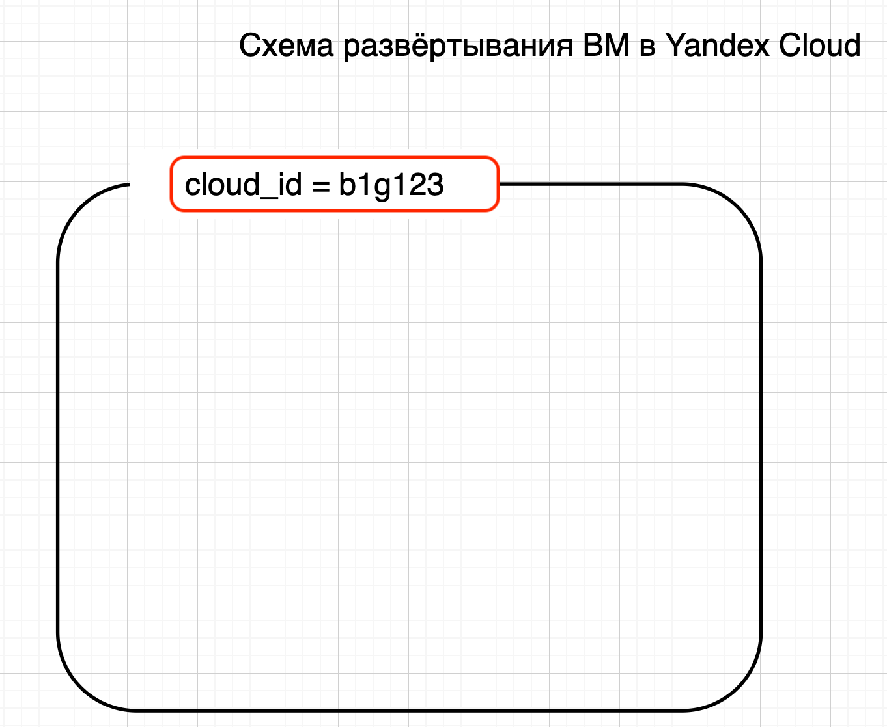
</p>

Для удаления атрибута надо нажать на символ перекрестия справа от поля ввода значения атрибута и нажать на кнопку `"Применить"`.

<p align="left">
    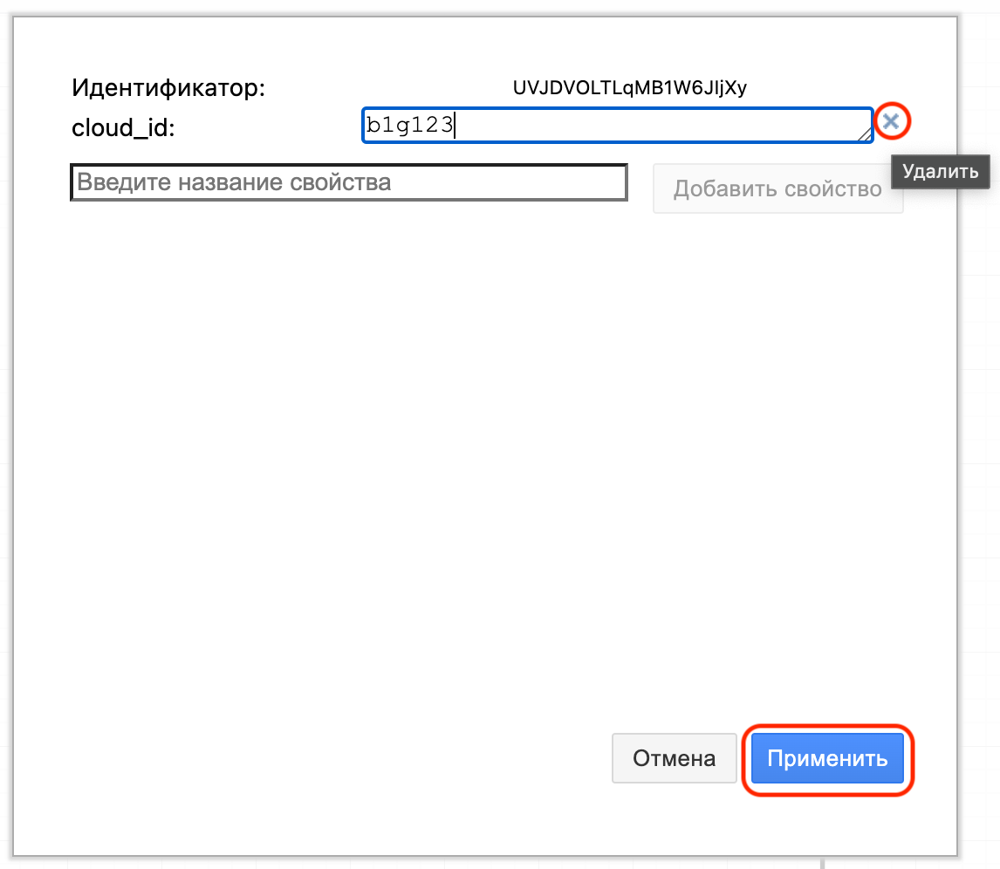
</p>
