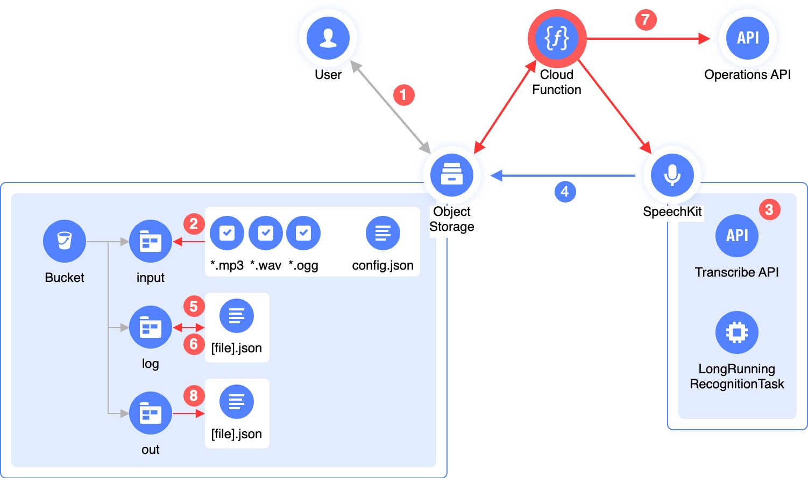

# SpeechKit Asynchronous Batch Recognizer

Данный скрипт берет аудио-файлы из бакета [Object Storage](https://cloud.yandex.ru/services/storage), отправляет их на распознавание в сервис [SpeechKit](https://cloud.yandex.ru/services/speechkit), после чего – сохраняет результат распознавания обратно в [бакет](https://cloud.yandex.ru/docs/storage/concepts/bucket) Object Storage.

Процесс распознавания длинных аудио – асинхронный, поэтому требуется, после первичной отправки аудио-файла сохранить его `operation-id`, и затем - периодически проверять статус задания. 
Если задание выполнено – можно сохранить результат, и убрать файл из последующих проверок статуса задания.

Скрипт написан на Python поэтому может быть легко разобран, доработан и оптимизирован под ваш сценарий.
<br><br>

## Процесс распознавания


<br><br>


1. Пользователь загружает аудио-файлы в [поддерживаемых форматах](https://cloud.yandex.ru/docs/speechkit/formats) в бакет Object Storage, в директорию (префикс) `input`. Также, может быть загружен файл `config.json`,  чтобы задать [язык](https://cloud.yandex.ru/docs/speechkit/stt/models) распознавания речи (по умолчанию, и при отсутствии файла `config.json` — будет использован русский язык `[ru-RU]`). 

    `config.json` имеет простой формат, содержит только один параметр в формате JSON:
    ```
    {
        'lang': 'ru-RU'
    }
    ```

2. Скрипт проверяет содержимое папки `input` в бакете, составляет список файлов, которые необходимо отправить на распознавание, исключая файлы неподдерживаемого формата, и исключает файлы, которые уже находятся в процессе распознавания (за счет проверки наличия файла в папке `log`). Также, проверяется наличие файла `config.json` и применяется тот язык распознавания, который в нем указан.

3. Скрипт отправляет в Transcribe API [прямые ссылки](https://cloud.yandex.ru/docs/storage/concepts/pre-signed-urls) на файлы из списка, составленного ранее.

4. Сервис SpeechKit получает файл из бакета по подписанной ссылке, создает задание `LongRunningRecognitionTask`, возвращает ID операции распознавания.

5. ID операции распознавания сохраняется в папке `log`, для каждого из отправленных на обработку файлов.

6. Периодически, в зависимости от расписания запуска скрипта, скрипт проверяет папку `log` на предмет наличия аудио-файлов в процессе обработки.

7. Если в файле содержится параметр `{'done': 'false'}` – скрипт отправляет ID операции в сервис Operations API, чтобы проверить статус операции.

8. Если операция завершена – результат операции сохраняется в папку `out` в формате JSON, а аналогичный файл в папке `log` изменяется на файл с содержимым `{'done': 'true'}`, чтобы исключить его из дальнейших проверок статуса операции.

## Использование

Скрипт может быть запущен локально, для этого необходимо указать следующие переменные окружения:

| Переменная        | Описание 
| -------------     | ------------- 
| S3_BUCKET         | Имя [бакета](https://cloud.yandex.ru/docs/storage/concepts/bucket) в Object Storage
| S3_PREFIX         | Префикс (или директория) для входящих файлов, например, `input`
| S3_PREFIX_LOG     | Префикс (или директория) для файлов в процессе обработки, например, `log`
| S3_PREFIX_OUT     | Префикс (или директория) для результатов обработки, например, `out`
| S3_KEY            | ID [статического ключа доступа](https://cloud.yandex.ru/docs/iam/operations/sa/create-access-key)
| S3_SECRET         | Секрет [статического ключа доступа](https://cloud.yandex.ru/docs/iam/operations/sa/create-access-key)
| API_SECRET        | Секрет [API-ключа](https://cloud.yandex.ru/docs/iam/operations/api-key/create)

Рекомендуется разделить обрабатываемые, обработанные и файлы для обработки при помощи разных префиксов (подпапок), иначе можно получить непредсказуемое поведение.

Для того, чтобы создать ключ для S3 и API-ключ – необходимо [создать сервисную учетную запись](https://cloud.yandex.ru/docs/iam/operations/sa/create), а также – [назначить роли](https://cloud.yandex.ru/docs/iam/operations/sa/assign-role-for-sa) `storage.editor` и `ai.speechkit-stt.user`.
<br><br>

## Примеры использования

Можно воспользоваться готовым [Terraform модулем](examples/asr-batch-function), который создает все необходимые ресурсы для начала обработки длинных аудио-файлов.

Можно установить [cronjob](examples/k8s-cronjob) для Kubernetes, который выполняет обработку входящих файлов по расписанию.