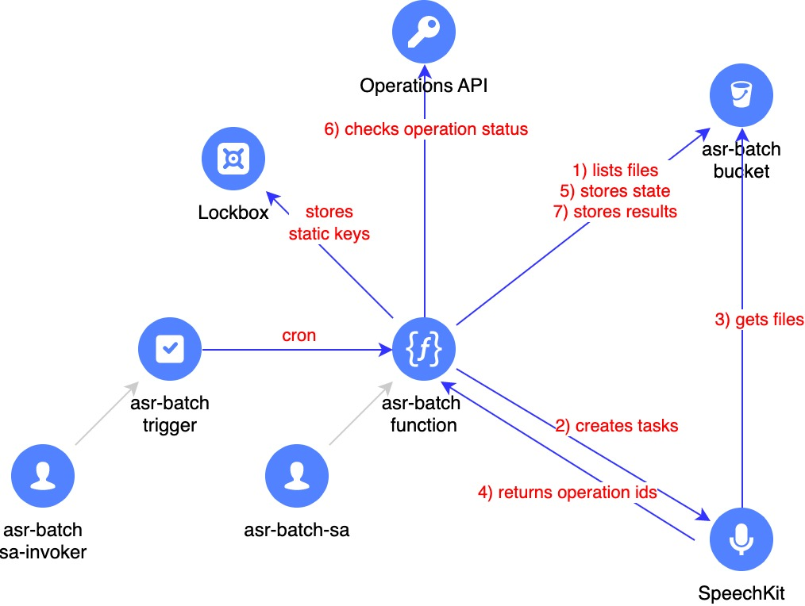

# Cloud Function для обработки длинных аудио-файлов


<br><br>

Данный модуль создает следующие ресурсы:

1. Бакет Object Storage
2. Функцию Cloud Function
3. Cron тригер для функции, который срабатывает каждые три минуты
4. Сервисную учетную запись с правами для работы с Object Storage, SpeechKit, Lockbox
5. Сервисную учетную запись для запуска функции Cloud Function
6. Статический ключ доступа для работы с Object Storage и API-ключ для работы со Speechkit
7. Секрет в [Lockbox](https://cloud.yandex.ru/services/lockbox) для безопасного хранения ключей, используемых функцией Cloud Function (сервис Lockbox находится в Preview)

По умолчанию, используются следующие переменные для имен директорий внутри бакета:
* `s3_prefix_input = "input"`
* `s3_prefix_log = "log"`
* `s3_prefix_out = "out"`

Также, используется аутентификация в провайдере Terraform через `key.json` файл. 
При необходимости, измените аутентификацию на токен.

## Установка

Чтобы запустить данный модуль, создайте файл с переменными `private.auto.tfvars` и сохраните в него folder_id и cloud_id вашего облака и каталога в нем:
```
cloud_id  = "b1g3xxxxxx"
folder_id = "b1g7xxxxxx
```

После этого, можно установить модуль Terraform:
```
terraform init
terraform apply
```

## Использование

После создания модуля, необходимо загрузить поддерживаемые аудио-файлы в созданный бакет, в директорию `input`.
При необходимости, измените язык распознавания в файле `config.json`, а файл сохраните в папке `input`.

`config.json` имеет простой формат, содержит только один параметр в формате JSON:
    ```
    {
        'lang': 'ru-RU'
    }
    ```

Функция будет запущена по тригеру и отправит файлы на распознавание, после чего – получит результат и сохранит его в папку `out`.
Статус работы функции можно отслеживать в ее логах, а также по созданию, "движению" и содержимому файлов заданий в папках `log` и `out`.

## Удаление

Перед удалением, не забудьте очистить созданный бакет (иначе процесс удаления прервется):
```
terraform destroy
```