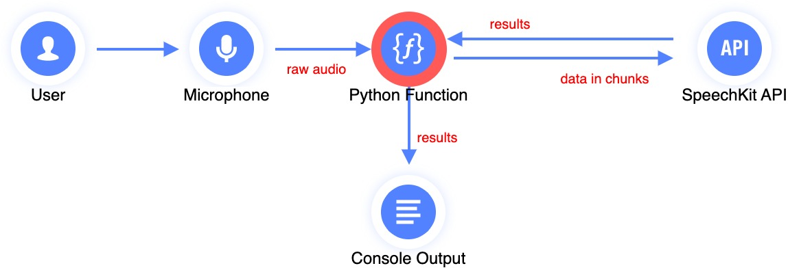
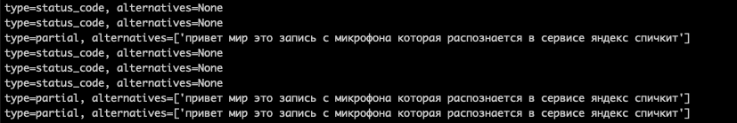

# SpeechKit Streaming Recognizer


<br><br>

Этот скрипт приведен для демонстрации потокового распознавания.

Скрипт записывает голос через микрофон и передает его на распознавание в сервис [SpeechKit](https://cloud.yandex.ru/services/speechkit), результат распознавания выводится в консоль.

Скрипт написан на Python поэтому может быть легко доработан и оптимизирован под ваш сценарий.

<br><br>

## Установка

Можно склонировать текущий репозиторий и перейти в папку `cloud_api/output`, где уже имеется скрипт `test.py`.
Необходимо лишь установить зависимости при помощи команды:
```
pip install -r requirements.txt
```

Либо, подготовить среду исполнения самостоятельно:

1) Склонируйте репозиторий [Yandex Cloud API](https://github.com/yandex-cloud/cloudapi):
```
git clone https://github.com/yandex-cloud/cloudapi
```

2) Установите пакет `grpcio-tools`:
```
pip install grpcio-tools
```

3) Перейдите в директорию со склонированным репозиторием Yandex Cloud API, создайте директорию `output` и сгенерируйте в ней код интерфейса клиента:
```
cd <путь_к_директории_cloudapi>
mkdir output
python -m grpc_tools.protoc -I . -I third_party/googleapis \
  --python_out=output \
  --grpc_python_out=output \
    google/api/http.proto \
    google/api/annotations.proto \
    yandex/cloud/api/operation.proto \
    google/rpc/status.proto \
    yandex/cloud/operation/operation.proto \
    yandex/cloud/ai/stt/v3/stt_service.proto \
    yandex/cloud/ai/stt/v3/stt.proto
```

В результате в директории `output` будут созданы файлы с интерфейсом клиента: `stt_pb2.py`, `stt_pb2_grpc.py`, `stt_service_pb2.py`, `stt_service_pb2_grpc.py` и файлы зависимостей.

4) Скопируйте файл `cloudapi/output/test.py` из текущего репозитория в вашу директорию `output`.

5) Установите зависимости:
```
pip install pyaudio
```

## Использование

1) Необходимо [создать сервисную учетную запись](https://cloud.yandex.ru/docs/iam/operations/sa/create), а также – [назначить роль](https://cloud.yandex.ru/docs/iam/operations/sa/assign-role-for-sa) `ai.speechkit-stt.user`. 

2) Для созданной сервисной учетной записи необходимо получить [API-ключ](https://cloud.yandex.ru/docs/iam/operations/api-key/create), его секрет потребуется для запуска скрипта.

3) Запустите скрипт `test.py`, указав в качестве аргумента секрет API-ключа:
```
python3 test.py --secret AQVNwRHSFFJJoLPQWMPxxxxxxxxxxxxxxxxxxxxxx
```

4) Говорите в микрофон, на экране консоли должен отображаться результат распознавания:



