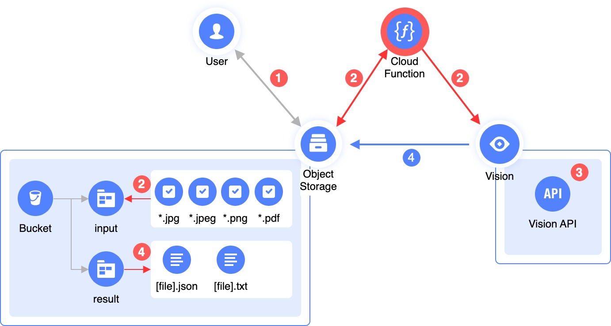

# OCR Recognizer 

Данный скрипт берет изображения и PDF-документы из бакета [Object Storage](https://cloud.yandex.ru/services/storage), отправляет их на распознавание в сервис [Vision](https://cloud.yandex.ru/services/vision), после чего – сохраняет результат распознавания обратно в [бакет](https://cloud.yandex.ru/docs/storage/concepts/bucket) Object Storage.

Скрипт написан на Python поэтому может быть легко разобран, доработан и оптимизирован под ваш сценарий.
  

## Процесс распознавания

  

1. Пользователь загружает изображения или документы в [поддерживаемых форматах](https://cloud.yandex.ru/docs/vision/concepts/ocr/#image-requirements) в бакет Object Storage, в директорию (префикс) `input`. 

2. Скрипт получает папки `input` в бакете, составляет список файлов, которые необходимо отправить на распознавание, исключая файлы неподдерживаемого формата, и исключает файлы, которые уже были распознаны (за счет проверки наличия файла в папке `result`). 

3. Скрипт скачивает по одному по [прямым ссылкам](https://cloud.yandex.ru/docs/storage/concepts/pre-signed-urls) файлы из списка, составленного ранее; и отправляет в сервис Vision.

4. Сервис Vision получает файл, обрабатывает его и возвращает результат распознавания, который сохраняется в папку `result` в формате JSON и в формате TXT.

## Использование

Скрипт может быть запущен локально, для этого необходимо указать следующие переменные окружения:

| Переменная        | Описание 
| -------------     | ------------- 
| S3_BUCKET         | Имя [бакета](https://cloud.yandex.ru/docs/storage/concepts/bucket) в Object Storage
| S3_PREFIX         | Префикс (или директория) для входящих файлов, например, `input`
| S3_PREFIX_OUT     | Префикс (или директория) для результатов обработки, например, `result`
| S3_KEY            | ID [статического ключа доступа](https://cloud.yandex.ru/docs/iam/operations/sa/create-access-key)
| S3_SECRET         | Секрет [статического ключа доступа](https://cloud.yandex.ru/docs/iam/operations/sa/create-access-key)
| API_SECRET        | Секрет [API-ключа](https://cloud.yandex.ru/docs/iam/operations/api-key/create)
| FOLDER_ID         | [ID каталога](https://cloud.yandex.ru/docs/resource-manager/operations/folder/get-id)

Рекомендуется разделить файлы для обработки и результаты обработки при помощи разных префиксов (подпапок), иначе можно получить непредсказуемое поведение.

Для того, чтобы создать ключ для S3 и API-ключ – необходимо [создать сервисную учетную запись](https://cloud.yandex.ru/docs/iam/operations/sa/create), а также – [назначить роли](https://cloud.yandex.ru/docs/iam/operations/sa/assign-role-for-sa) `storage.editor` и `ai.vision.user`.
  

## Примеры использования

Можно воспользоваться готовым [Terraform модулем](examples/ocr-function), который создает все необходимые ресурсы для начала обработки изображений и документов.