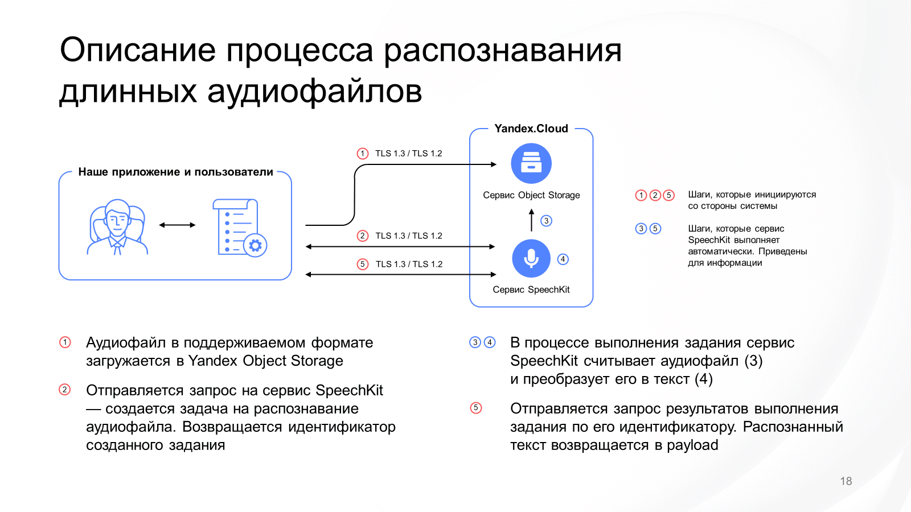

# Batch recognizer — распознавание большого количества файлов 

Сценарий для распознавания больших архивов аудио.

Аудио файлы должны быть предварительно конвертированы в формат, который [поддерживается SpeetchKit](https://cloud.yandex.ru/docs/speechkit/stt/formats), и иметь расширение `*.wav` <br/>
Подготовленные файлы должны быть загружены в бакет на Object Storage. Бакет может содержать вложенные папки.<br/>
Фактически утилита реализвет процесс распознавания длинных аудио для всех файлов в бакете.<br/>

### Команда запускается в двух режимах:
+ Cоздание заданий на распознавание (запускается первым) - `--mode stt_create_tasks`
+ Получение результатов заданий (запускается для получения результатов)- `--mode stt_task_results`


### Инструкция по установке:
+ Создайте в интерфейсе облака “бакет” – хранилище файлов куда можно будет загрузить аудиофайлы. https://cloud.yandex.ru/docs/storage/operations/buckets/create 
+ Создайте сервисный аккаунт https://cloud.yandex.ru/docs/iam/operations/sa/create  с правами “editor” в том-же каталоге где был создан “бакет” 
  https://cloud.yandex.ru/docs/iam/operations/sa/assign-role-for-sa
+ Сгенерируйте статические ключи доступа для созданного сервисного аккаунта https://cloud.yandex.ru/docs/iam/operations/sa/create-access-key ***Обязательно запишите access key и secret key*** эти ключи будут нужны для авторизации программы в сервисе хранилища
+ Установите на рабочую станцию https://cloud.yandex.com/docs/cli/quickstart#install консоль облака для упрощенного получения токена авторизации в сервисе распознавания аудио.
+ Установите на рабочую станцию [.NET](https://dotnet.microsoft.com/download)
+ Авторизуйте YC от имени вашей учетной записи https://cloud.yandex.ru/docs/cli/operations/authentication/user или https://cloud.yandex.ru/docs/cli/operations/authentication/federated-user или от сервисного аккаунта из пункта 2
+ Скачайте актуальную версию   https://dotnet.microsoft.com/download
+ Скомпилируйте приложение или скачайте и распакуйте [архив с релизом](https://github.com/yandex-cloud/yc-architect-solution-library/releases/tag/SpeechKit) в удобную директорию


### Инструкция по работе:
<ol>
 <li>Получите iam токен запустив YC (yc iam create-token)</li>
 <li>Запишите этот токен в переменную или сохраните в удобнее место</li>
 <li>Подготовить параметры запуска утилиты в соотв с приером ниже</li>
 <li>Для работы на windows используйте скомпилированный файл SkBatchAsrClient.exe</li>
 <li>Для работы на unix-based системах используйте приложение dotnet (из п5):
dotnet SkBatchAsrClient.dll</li>
</ol>

#### Пример команды на запуск процесса создания задач на распознавание:
```bsh
dotnet SkBatchAsrClient.dll  --s3-accessKey "xxxxxxx" --s3-secretKey  "xxxxxxx" --bucket my_s3_bycket_with_wav --iam-token “xxxxxxxxx" --folder-id xxxxxx   --audio-encoding Linear16Pcm --sample-rate 48000 --model="general:rc" --lang="ru-RU" --mode stt_create_tasks
``` 
#### Пример команды за получение результатов:
```bsh
dotnet SkBatchAsrClient.dll  --s3-accessKey "xxxxxxx" --s3-secretKey  "xxxxxxx" --bucket my_s3_bycket_with_wav --iam-token “xxxxxxxxx" --folder-id xxxxxx   --audio-encoding Linear16Pcm --sample-rate 48000 --model="general:rc" --lang="ru-RU" --mode stt_task_result
``` 

+ -s3-accessKey – ключ доступа к хранилищу полученный в пункте 3
+ --s3-secretKey  - секретная часть ключа доступа к хранилищу полученная в пункте 3
+ --bucket my_s3_bycket_with_wav – “бакет” созданный в пункте 1
+ --iam-token – токен полученный при запуске команды yc iam create-token в пункте 8
+ --folder-id xxxxxx   - iD каталога где будет производится распознавание
+ --audio-encoding Linear16Pcm – используемый в файле кодек.
+ --sample-rate 48000 - частота дискретизации (должна соответсвовать частоте дискретизации исходных аудио файлов)<br/>
Если файл нужно предварительно транскодировать используйте скрипт по транскодигу: https://github.com/yandex-cloud/yc-architect-solution-library/tree/main/yc-ai/yc-speechkit-transcoder <br/>
или используйте FFMPEG для конвертации в нужный формат<br/>
Пример команды, которая конвертирует все файлы с расширением *mp4* в папке:
```bsh
for f in *.mp4; do ffmpeg -i "$f" -f s16le -acodec pcm_s16le -map 0:1 -ac 1 -ar 48000 "${f%.*}.wav"; done )
```
Пример команды, которая конвертирует файл с инменем *input-audio.mp3*:
```bsh
ffmpeg -i "input-audio.mp3"  -acodec pcm_s16le -ac 1 -ar 48000  "output-audio.wav"
```

+ --model="general:rc" выбор модели для распознавания https://cloud.yandex.ru/docs/speechkit/stt/models
+ --lang="ru-RU язык который нужно распознать

