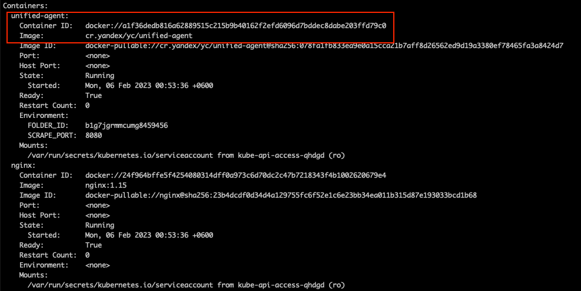
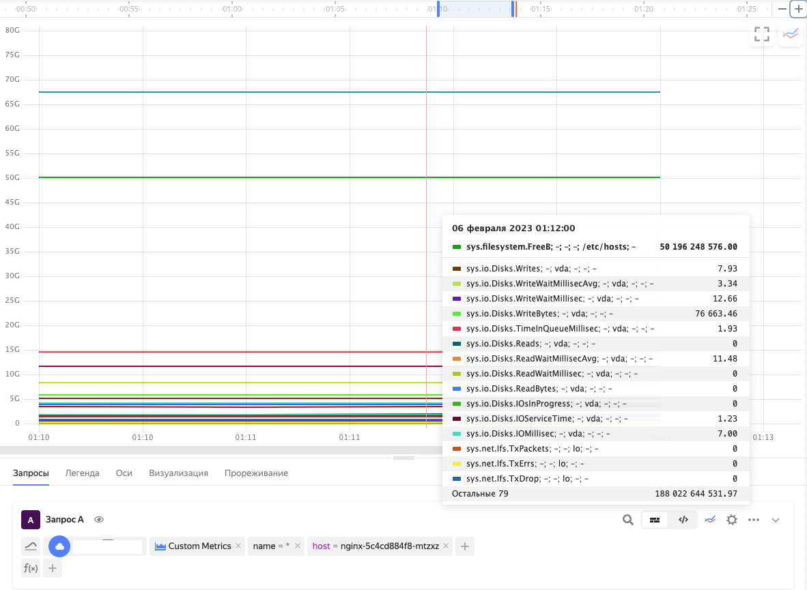

# Installing Unified Agent to collect pod's metrics using Kyverno policy

## Install kyverno
Install Kyverno using Kubernetes Marketplace or with the Helm chart:
[Installation guides](https://cloud.yandex.com/en/docs/managed-kubernetes/operations/applications/kyverno)

## Create the policy

Create a file named `inject-unified-agent.yaml` with the following content, but fill the  `<FOLDER_ID>` placeholder with the ID of your folder in Yandex Cloud:
```yaml
apiVersion: kyverno.io/v1
kind: ClusterPolicy
metadata:
  name: inject-unified-agent
spec:
  rules:
  - name: inject-unified-agent
    match:
      resources:
        kinds:
        - Deployment
        - DaemonSet
        - StatefulSet
    mutate:
      patchStrategicMerge:
        metadata:
          annotations:
            (monitoring.yc.io/unified-agent-inject): "true"
        spec:
          template:
            spec:
              containers:
              - name: unified-agent
                image: cr.yandex/yc/unified-agent
                imagePullPolicy: IfNotPresent
                env:
                  - name: FOLDER_ID
                    value: <FOLDER_ID>
                  - name: SCRAPE_PORT
                    value: "{{request.object.metadata.annotations.\"monitoring.yc.io/scrape-port\"}}"
```

Apply the policy file with the following command:
```bash
kubectl apply -f inject-unified-agent.yaml
```

## Create a test app
Edit the application's annotations, if the application already exports metrics in Prometheus format, or create the test application using the example below.

Create a file `nginx.yaml` with the following content:
```yaml
apiVersion: apps/v1
kind: Deployment
metadata:
  name: nginx
  annotations:
    monitoring.yc.io/unified-agent-inject: "true"
    monitoring.yc.io/scrape-port: "8080"
spec:
  selector:
    matchLabels:
      app: nginx
  template:
    metadata:
      labels:
        app: nginx
    spec:
      containers:
        - name: nginx
          image: nginx:1.15
```

Apply the application with the following command:
```bash
kubectl apply -f nginx.yaml
```

## Checking the result
Make sure that the pod for `nginx` application contains the sidecar container named `unified-agent` and that it's in `Running` state:
```bash
kubectl describe pod nginx-5c4cd884f8-mtzxz
```



Make sure that monitoring metrics are being pushed into [Yandex Monitoring](https://cloud.yandex.com/en-ru/services/monitoring) service.
Go to [the main page](https://monitoring.cloud.yandex.ru/) of Yandex Monitoring service and open the **Metric Explorer** tab.

Create a new query with:
* the folder which stores the metrics;
* `service=custom` selector;
* `host` with the Kubernetes test pod name.

```
"*"{folderId="<FOLDER_ID>", service="custom", host="nginx-5c4cd884f8-mtzxz"}
```


