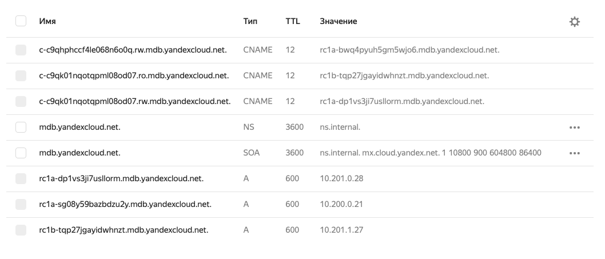

# Стенд в котором можно проверить dns пиринг


Стенд создает 3 сети ( не связанные по IP) 

В первой сети ( infra) создается сервер для сервера, который будет делать тесты ( резолвить A и CNAME записи баз данных в других сетях)
В сетях bu_ будет создано по кластеру баз данных mysql


Схема стенда 


## Требования
- Terraform ~>0.14
- YC cli
- bash
- jq
- Доступный в превью сервис Cloud DNS 

### Настройка Yandex.Cloud

- Установите [YC cli](https://cloud.yandex.com/docs/cli/quickstart) и иницируйте. 
- Настройте авторизацию в YC для Terraform
```
export YC_TOKEN=$(yc iam create-token)
export YC_CLOUD_ID=$(yc config get cloud-id) #либо явно пропишите id облака 
export YC_FOLDER_ID=$(yc config get folder-id) #либо явно пропишите id фолдера 
``` 

### Запуск примера

```
terraform init
terraform apply
``` 

И подождите 10 минут


# Проверка

В UI можно посмотреть все созданные записи




В terraform outputs вы увидите fdqn хостов и cname кластеров, которые надо проверять.


Зайдите на тестовую вм
```
ssh ubuntu@$(terraform output -json | jq -r .dns_vm_ip.value)
```
и выполняйте DIG на записи из terraform outputs 

например 


```
ubuntu@fhm5gekmqc7pglril9on:~$ dig c-c9qrebdclp1nskiumd1t.rw.mdb.yandexcloud.net

; <<>> DiG 9.16.1-Ubuntu <<>> c-c9qrebdclp1nskiumd1t.rw.mdb.yandexcloud.net
;; global options: +cmd
;; Got answer:
;; ->>HEADER<<- opcode: QUERY, status: NOERROR, id: 57015
;; flags: qr rd ra; QUERY: 1, ANSWER: 2, AUTHORITY: 0, ADDITIONAL: 1

;; OPT PSEUDOSECTION:
; EDNS: version: 0, flags:; udp: 65494
;; QUESTION SECTION:
;c-c9qrebdclp1nskiumd1t.rw.mdb.yandexcloud.net. IN A

;; ANSWER SECTION:
c-c9qrebdclp1nskiumd1t.rw.mdb.yandexcloud.net. 12 IN CNAME rc1a-sg08y59bazbdzu2y.mdb.yandexcloud.net.
rc1a-sg08y59bazbdzu2y.mdb.yandexcloud.net. 599 IN A 10.200.0.21

;; Query time: 4 msec
;; SERVER: 127.0.0.53#53(127.0.0.53)
;; WHEN: Wed Mar 17 10:16:35 UTC 2021
;; MSG SIZE  rcvd: 126

ubuntu@fhm5gekmqc7pglril9on:~$ dig c-c9qk01nqotqpml08od07.rw.mdb.yandexcloud.net

; <<>> DiG 9.16.1-Ubuntu <<>> c-c9qk01nqotqpml08od07.rw.mdb.yandexcloud.net
;; global options: +cmd
;; Got answer:
;; ->>HEADER<<- opcode: QUERY, status: NOERROR, id: 5884
;; flags: qr rd ra; QUERY: 1, ANSWER: 2, AUTHORITY: 0, ADDITIONAL: 1

;; OPT PSEUDOSECTION:
; EDNS: version: 0, flags:; udp: 65494
;; QUESTION SECTION:
;c-c9qk01nqotqpml08od07.rw.mdb.yandexcloud.net. IN A

;; ANSWER SECTION:
c-c9qk01nqotqpml08od07.rw.mdb.yandexcloud.net. 12 IN CNAME rc1a-dp1vs3ji7usllorm.mdb.yandexcloud.net.
rc1a-dp1vs3ji7usllorm.mdb.yandexcloud.net. 599 IN A 10.201.0.28

;; Query time: 4 msec
;; SERVER: 127.0.0.53#53(127.0.0.53)
;; WHEN: Wed Mar 17 10:16:45 UTC 2021
;; MSG SIZE  rcvd: 126
```


#  Завершение работы


```
terraform destroy
```

