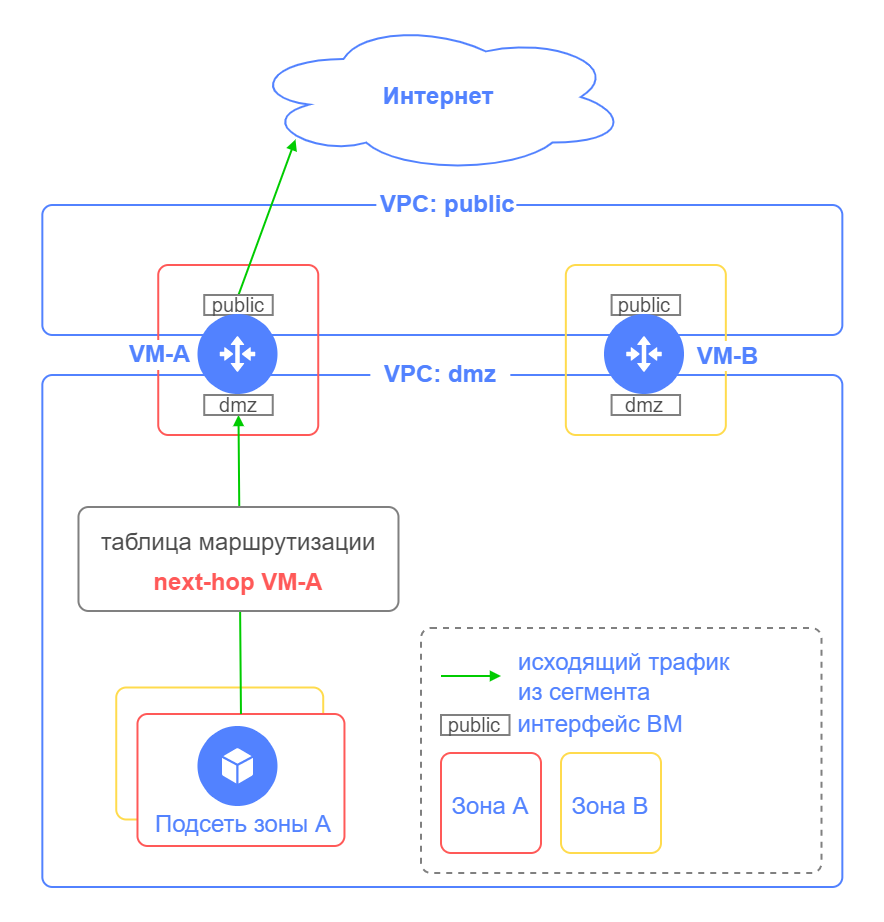
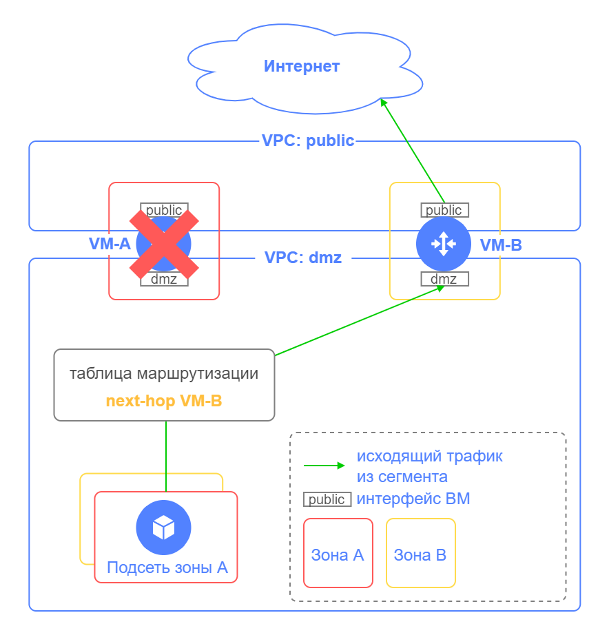
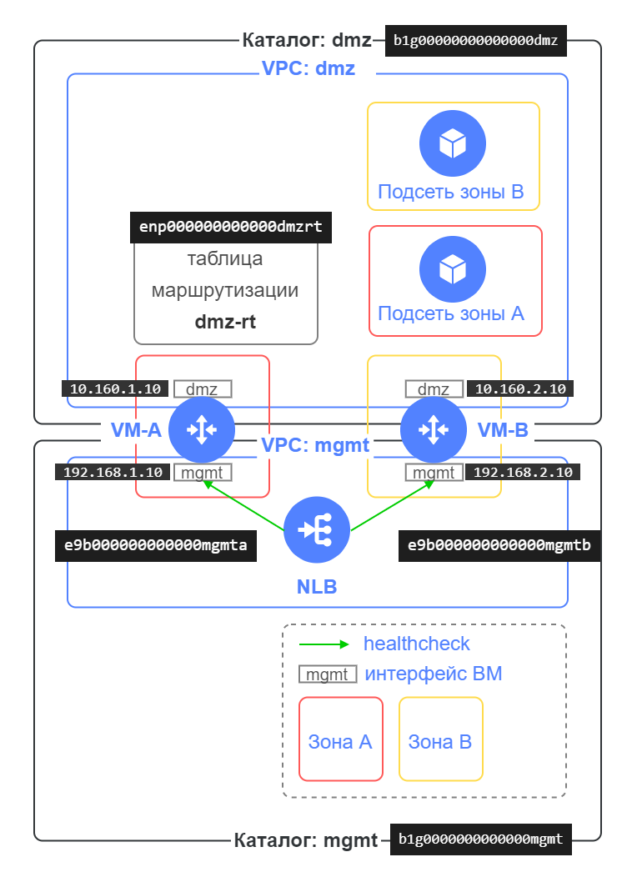

# Модуль route-switcher для обеспечения отказоустойчивости виртуальных машин, выполняющих функции межсетевого экранирования, сетевой безопасности и маршрутизации трафика 

## Содержание

- [Введение](#введение)
- [Возможности модуля](#возможности-модуля)
- [Компоненты модуля](#компоненты-модуля)
- [Входные параметры модуля](#входные-параметры-модуля)
- [Пример задания входных параметров модуля](#пример-задания-входных-параметров-модуля)
- [Выходные параметры модуля](#выходные-параметры-модуля)
- [Подготовка к развертыванию](#подготовка-к-развертыванию)
- [Порядок развертывания](#порядок-развертывания)
- [Проверка отказоустойчивости](#проверка-отказоустойчивости)
- [Остановка работы модуля](#остановка-работы-модуля)
- [Изменение входных параметров модуля](#изменение-входных-параметров-модуля)
- [Пример использования модуля в решении по защищенной высокодоступной сетевой инфраструктуре](#пример-использования-модуля-в-решении-по-защищенной-высокодоступной-сетевой-инфраструктуре)


## Введение

В Yandex Cloud можно развернуть облачную инфраструктуру для защиты и сегментации инфраструктуры на зоны безопасности с использованием виртуальных машин (далее сетевых ВМ), выполняющих функции межсетевого экранирования, сетевой безопасности и маршрутизации трафика.
Каждый сегмент сети (далее сегмент) содержит ресурсы одного назначения, обособленные от других ресурсов. В облаке каждому сегменту может соответствовать свой каталог и своя облачная сеть VPC. В таком сценарии связь между сегментами обычно происходит через сетевые ВМ с несколькими сетевыми интерфейсами, размещенными в каждом VPC.

Для обеспечения высокой доступности развернутых приложений в такой инфраструктуре используется несколько сетевых ВМ, размещенных в разных зонах доступности.
С помощью [статической маршрутизации](https://cloud.yandex.ru/docs/vpc/concepts/static-routes) можно направлять трафик из подсетей через сетевые ВМ.

В облачной сети Yandex Cloud не поддерживается работа протоколов VRRP/HSRP между сетевыми ВМ.

Модуль route-switcher позволяет переключить исходящий из сегмента трафика при отказе сетевой ВМ на резервную ВМ.

В примере на схеме VM-A и VM-B работают в режиме Active/Standby для исходящего трафика из сегмента.



В случае отказа VM-A модуль route-switcher переключит исходящий трафик на VM-B и сетевая связанность с интернетом и между сегментами будет выполняться через VM-B.




## Возможности модуля
- Переключение next hop адресов в таблицах маршрутизации при отказе сетевой ВМ на резервную ВМ  
- Возврат next hop адресов в таблицах маршрутизации на сетевую ВМ после ее восстановления (настраиваемая опция)
- Среднее время реакции на сбой: 1 мин
- Работа с сетевыми ВМ, имеющими несколько сетевых интерфейсов в разных VPC
- Поддержка нескольких таблиц маршрутизации в разных VPC
- В качестве next hop в таблице маршрутизации можно указывать разные сетевые ВМ для разных префиксов
- Поддержка нескольких сетевых ВМ (минимум 2)
- Указание TCP порта для проверки доступности сетевых ВМ
- Логирование работы модуля в Cloud Logging

## Компоненты модуля

Модуль route-switcher создает следующие ресурсы, необходимые для его работы:
- Облачную функцию route-switcher
- NLB 
- Бакет в Object Storage 


Описание элементов схемы:

| Название элемента | Описание |
| ----------- | ----------- |
| Каталог: mgmt | Каталог для размещения компонент модуля route-switcher |
| VPC: mgmt | Сетевые интерфейсы ВМ, используемые для проверки их доступности, размещаются в подсетях этой сети. Обычно используется сегмент сети управления. |
| VM-A, VM-B | Сетевые ВМ, выполняющие функции межсетевого экранирования, сетевой безопасности и маршрутизации трафика, для которых требуется обеспечить отказоустойчивость |
| Функция route-switcher | Облачная функция, которая выполняет проверку состояния сетевых ВМ и в случае недоступности сетевых ВМ переключает next hop адреса в таблицах маршрутизации на резервные ВМ. Также функция возвращает next hop адреса в таблицах маршрутизации на сетевую ВМ после ее восстановления (возврат - это настраиваемая опция). | 
| NLB | Сетевой балансировщик для мониторинга доступности сетевых ВМ |
| Object Storage | Бакет в Object Storage для хранения файла конфигурации с информацией:<br>- таблицы маршрутизации с указанием предпочтительных next hop адресов для префиксов<br>- IP-адреса сетевых ВМ: для проверки доступности, адреса для каждого сетевого интерфейса ВМ (IP-адрес ВМ и соответствующий IP-адрес резервной ВМ) |


### Алгоритм работы функции route-switcher

<details>
<summary>Посмотреть подробности</summary>

Функция route-switcher вызывается по триггеру раз в минуту, проверяет, в каком состоянии находятся сетевые ВМ, и в случае недоступности сетевых ВМ переключает next hop адреса в таблицах маршрутизации. При восстановлении сетевой ВМ функция route-switcher возвращает ее next hop адреса в таблицах маршрутизации (если настроена такая опция).


</details>


## Входные параметры модуля

Перед вызовом модуля ему нужно передать набор входных параметров:

| Название | Описание | Тип | Значение по умолчанию | Обязательный |
| ----------- | ----------- | ----------- | ----------- | ----------- |
| start_module | Включить или выключить работу модуля (создает или удаляет триггер, запускающий облачную функцию route-switcher раз в минуту). Используется значение `true` для включения, `false` для выключения. | `bool` | `false` | да |
| folder_id | ID каталога для размещения компонент модуля route-switcher | `string` | `null` | да |
| route_table_folder_list | Список ID каталогов, в которых размещены таблицы маршрутизации из списка route_table_list | `list(string)` | `[]` | да |
| route_table_list | Список ID таблиц маршрутизации, для которых требуется переключение next hop адресов | `list(string)` | `[]` | да |
| router_healthcheck_port | TCP порт для проверки доступности сетевых ВМ |  `number` | `null` | да |
| back_to_primary | Включить или отключить возврат next hop адресов в таблицах маршрутизации на сетевую ВМ после ее восстановления. Используется значение `true` для включения, `false` для выключения. | `bool` | `true` | нет |
| routers | Список IP-адресов сетевых ВМ. Для каждой ВМ необходимо указать:<br>`healthchecked_ip`: IP-адрес, используемый для проверки доступности сетевой ВМ<br>`healthchecked_subnet_id`: подсеть для healthchecked_ip<br>`interfaces`: список IP-адресов для сетевых интерфейсов этой ВМ<br>&nbsp;&nbsp;`own_ip`: IP-адрес интерфейса ВМ<br>&nbsp;&nbsp;`backup_peer_ip`: IP-адрес резервной ВМ для резервирования own_ip | <pre>list(object({<br> healthchecked_ip = string<br> healthchecked_subnet_id = string<br> interfaces = list(object({<br> own_ip = string<br> backup_peer_ip = string<br> }))<br> }))</pre> | `[]` | да |


## Пример задания входных параметров модуля

Пример схемы с каталогами, таблицами маршрутизации и IP-адресами сетевых ВМ.




<details>
<summary>Посмотреть пример задания входных параметров модуля с использованием строковых значений.</summary>

```yaml
module "route_switcher" {
  source    = "./modules/route-switcher/"
  start_module          = false
  folder_id = "b1g0000000000000mgmt" 
  route_table_folder_list = ["b1g00000000000000dmz"]
  route_table_list      = ["enp000000000000dmzrt"] 
  router_healthcheck_port = 22
  back_to_primary = true
  routers = [
    {
      healthchecked_ip = "192.168.1.10"
      healthchecked_subnet_id = "e9b000000000000mgmta"
      interfaces = [
        {
          own_ip = "10.160.1.10"
          backup_peer_ip = "10.160.2.10"
        }
      ]
    },
    {
      healthchecked_ip = "192.168.2.10"
      healthchecked_subnet_id = "e9b000000000000mgmtb"
      interfaces = [
        {
          own_ip = "10.160.2.10"
          backup_peer_ip = "10.160.1.10"
        }
      ]
    }
  ]
}
```

</details>

<details>
<summary>Посмотреть пример задания входных параметров модуля с использованием ресурсных объектов Terraform.</summary>

Если для развертывания сетевых ВМ, таблиц маршрутизации, подсетей и каталогов используется Terraform, то во входных параметрах модуля указываются ресурсные объекты Terraform.

```yaml
module "route_switcher" {
  source    = "./modules/route-switcher/"
  start_module          = false
  folder_id = var.folder_id
  route_table_folder_list = [yandex_resourcemanager_folder.dmz.id]
  route_table_list      = [yandex_vpc_route_table.dmz-rt.id]
  router_healthcheck_port = 22
  back_to_primary = true
  routers = [
    {
      healthchecked_ip = yandex_compute_instance.router-a.network_interface.1.ip_address
      healthchecked_subnet_id = yandex_vpc_subnet.mgmt_subnet_a.id
      interfaces = [
        {
          own_ip = yandex_compute_instance.router-a.network_interface.0.ip_address
          backup_peer_ip = yandex_compute_instance.router-b.network_interface.0.ip_address
        }
      ]
    },
    {
      healthchecked_ip = yandex_compute_instance.router-b.network_interface.1.ip_address
      healthchecked_subnet_id = yandex_vpc_subnet.mgmt_subnet_b.id
      interfaces = [
        {
          own_ip = yandex_compute_instance.router-b.network_interface.0.ip_address
          backup_peer_ip = yandex_compute_instance.router-a.network_interface.0.ip_address
        }
      ]
    }
  ]
}
```

</details>


## Выходные параметры модуля

| Название | Описание |
| ----------- | ----------- |
| route-switcher_nlb | Имя сетевого балансировщика в каталоге `folder_id` для мониторинга доступности сетевых ВМ |
| route-switcher_bucket | Имя бакета в Object Storage в каталоге `folder_id` для хранения файла конфигурации с информацией:<br>- таблицы маршрутизации с указанием предпочтительных next hop адресов для префиксов<br>- IP-адреса сетевых ВМ: для проверки доступности, адреса для каждого сетевого интерфейса ВМ (IP-адрес ВМ и соответствующий IP-адрес резервной ВМ) |
| route-switcher_function | Имя облачной функции в каталоге `folder_id`, обеспечивающей работу модуля route-switcher по отказоустойчивости исходящего трафика из сегментов |


## Подготовка к развертыванию

1. Перед развертыванием в Yandex Cloud должны существовать следующие объекты:
    - Каталог `folder_id` для размещения компонент модуля route-switcher
    - Таблицы маршрутизации, для которых требуется переключение next hop адресов
    - Каталоги, в которых размещены таблицы маршрутизации из списка `route_table_list`
    - Сетевые ВМ должны быть предварительно настроены, запущены и должны функционировать 

2. [Проверки состояния](https://cloud.yandex.ru/docs/network-load-balancer/concepts/health-check) сетевых ВМ осуществляются с IP-адресов из диапазонов `198.18.235.0/24` и `198.18.248.0/24`. Настройки правил фильтрации трафика у сетевых ВМ должны разрешать прием трафика с адресов этого диапазона, иначе проверки сетевым балансировщиком не будут выполняться и целевые ресурсы не перейдут в статус `Healthy`. В результате модуль route-switcher не сможет работать. Вы можете привязать к целевым ресурсам группу безопасности со следующим правилом для входящего трафика:
    - Диапазон портов: порт `router_healthcheck_port`, заданный во входных параметрах модуля route-switcher
    - Протокол: `TCP`
    - Источник: `Проверки состояния балансировщика`

    Такой же диапазон адресов и TCP порт должны быть настроены в разрешающем правиле для входящего трафика политики доступа в самих сетевых ВМ (например, в политике доступа межсетевых экранов).

3. Модуль записывает [логи работы функции](https://cloud.yandex.ru/docs/functions/operations/function/function-logs) в Cloud Logging группу по умолчанию в каталоге `folder_id`. Время хранения логов по умолчанию 3 дня. Можно [изменить срок хранения](https://cloud.yandex.ru/docs/logging/operations/retention-period) записей в группе Cloud Logging.


## Порядок развертывания

> **Важная информация**
> 
> Развертывать решение необходимо со значением `false` (значение по умолчанию) для входного параметра `start_module` модуля route-switcher.

1. Выполните инициализацию Terraform:
    ```bash
    terraform init
    ```

2. Проверьте конфигурацию Terraform файлов:
    ```bash
    terraform validate
    ```

3. Проверьте список создаваемых облачных ресурсов:
    ```bash
    terraform plan
    ```

4. Создайте ресурсы:
    ```bash
    terraform apply
    ```

5. После развертывания ресурсов убедитесь, что проверка состояния сетевых ВМ выдает значение `Healthy`. Для этого в консоли Yandex Cloud в каталоге `folder_id` выберите сервис `Network Load Balancer` и перейдите на страницу сетевого балансировщика `route-switcher-lb-...`. Раскройте целевую группу и убедитесь, что состояния целевых ресурсов `Healthy`. Если состояние их `Unhealthy`, то необходимо проверить, что сетевые ВМ запущены и функционируют, и проверить правила фильтрации трафика у сетевых ВМ (пункт 2. [подготовки к развертыванию](#подготовка-к-развертыванию)).

6. После того, как вы убедились, что проверка состояния сетевых ВМ выдает значение `Healthy`, измените значение входного параметра `start_module` модуля route-switcher на `true` для включения работы модуля и выполните команды:
    ```bash
    terraform plan
    terraform apply
    ```
7. После выполнения `terraform apply` с параметром `start_module = true` в каталоге `folder_id` создается триггер `route-switcher-trigger-...`, запускающий облачную функцию route-switcher раз в минуту. Триггер начинает работать в течение 5 минут после создания.

После выполнения всех шагов по развертыванию в сегментах будет осуществляться переключение исходящего трафика при отказе сетевой ВМ на резервную ВМ.

## Проверка отказоустойчивости

> **Важная информация**
> 
> Для проверки отказоустойчивости необходимо будет остановить сетевую ВМ, что приведет к временной недоступности сети в процессе переключения. В продуктивной среде необходимо согласовать технологическое окно для проведения проверки.

1. Выберите или создайте Linux ВМ в сегменте, для которого модуль route-switcher обеспечивает отказоустойчивость исходящего трафика. В консоли Yandex Cloud измените параметры этой ВМ, добавив "Разрешить доступ к серийной консоли". Подключитесь к серийной консоли ВМ и аутентифицируйтесь.

2. Запустите в этой ВМ исходящий трафик из сегмента с помощью `ping` к ресурсу в интернете или в другом сегменте.
    
3. В консоли Yandex Cloud выберите сетевую ВМ, через которую проходит исходящий трафик из сегмента, и остановите ее, эмулируя отказ.

4. Наблюдайте за пропаданием пакетов ping. После отказа сетевой ВМ может наблюдаться пропадание трафика, после чего трафик должен восстановиться.

5. Проверьте, что в таблице маршрутизации в каталоге сегмента используется адрес резервной ВМ для next hop.

6. В консоли Yandex Cloud запустите выключенную сетевую ВМ, эмулируя восстановление. 

7. Если в настройках модуля route-switcher был указан параметр `back_to_primary = true`, то после восстановления сетевой ВМ на нее произойдет переключение исходящего трафика. Может наблюдаться пропадание трафика, после чего трафик должен восстановиться. Проверьте, что в таблице маршрутизации в каталоге сегмента используется для next hop адрес сетевой ВМ из шага 3.

8. В консоли Yandex Cloud для Linux ВМ, с которой выполнялся `ping`, отключите "Разрешить доступ к серийной консоли".


## Остановка работы модуля

Если вы хотите временно остановить работу модуля route-switcher, то измените значение входного параметра `start_module` модуля route-switcher на `false` для выключения работы модуля и выполните команды:
```bash
terraform plan
terraform apply
```

После выполнения этих команд удалится триггер `route-switcher-trigger-...`, запускающий облачную функцию route-switcher раз в минуту, и работа модуля будет остановлена. 

Если вам потребуется включить работу модуля обратно, то выполните пункты 5 и 6 из раздела [Порядок развертывания](#порядок-развертывания).

## Изменение входных параметров модуля

В процессе работы модуля можно изменить входные параметры модуля. Например, во входных параметрах вы можете добавить или удалить IP-адреса сетевых ВМ или таблицы маршрутизации.

> **Важная информация**
> 
> Изменение входных параметров модуля необходимо выполнять при работающих сетевых ВМ. Убедитесь, что проверка состояния сетевых ВМ выдает значение `Healthy` (смотрите пункт 5 из раздела [Порядок развертывания](#порядок-развертывания)). 
> Модуль route-switcher сохранит текущие next hop адреса таблиц маршрутизации как предпочтительные в файле конфигурации в бакете Object Storage.

Для изменения входных параметров модуля выполните следующие действия:

1. Задайте входные параметры модуля.

2. Выполните команды:
    ```bash
    terraform plan
    terraform apply
    ```


## Пример использования модуля в решении по защищенной высокодоступной сетевой инфраструктуре

Вы можете познакомиться с примером использования модуля route-switcher в решении по развертыванию защищенной высокодоступной сетевой инфраструктуры с выделением DMZ на основе Next-Generation Firewall: [https://github.com/yandex-cloud/yc-architect-solution-library/tree/main/demos/dmz-fw-ha](https://github.com/yandex-cloud/yc-architect-solution-library/tree/main/demos/dmz-fw-ha)
