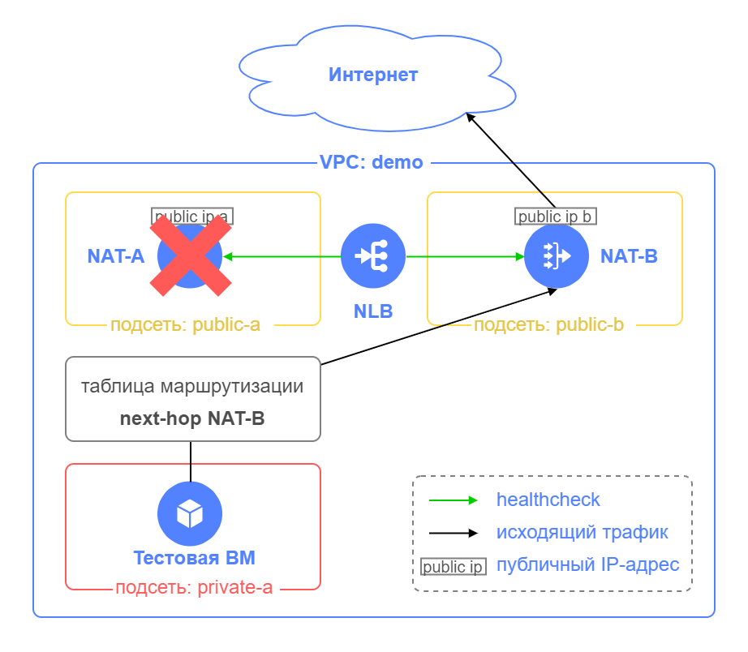

# Пример использования модуля route-switcher для обеспечения отказоустойчивости NAT-инстанс

## Содержание

- [Введение](#введение)
- [Подготовка к развертыванию](#подготовка-к-развертыванию)
- [Порядок развертывания](#порядок-развертывания)
- [Проверка отказоустойчивости](#проверка-отказоустойчивости)
- [Удаление созданных ресурсов](#удаление-созданных-ресурсов)

## Введение

Для организации доступа в интернет виртуальных машин и других облачных ресурсов, размещенных в Yandex Cloud, может использоваться [NAT-инстанс](https://cloud.yandex.ru/marketplace/products/yc/nat-instance-ubuntu-18-04-lts). С помощью [статической маршрутизации](https://cloud.yandex.ru/docs/vpc/concepts/static-routes) трафик из подсетей направляется в интернет через NAT-инстанс.

Для обеспечения высокой доступности можно развернуть несколько NAT-инстансов, размещенных в разных зонах доступности. [Модуль route-switcher](https://github.com/yandex-cloud/yc-architect-solution-library/tree/main/yc-route-switcher-v2) позволяет переключить исходящий в интернет трафик из подсетей при отказе одного из NAT-инстанс на резервный.

В примере на схеме NAT-инстанс NAT-A является основным для исходящего в интернет трафика, а NAT-B резервным.


В случае отказа NAT-A модуль route-switcher переключит исходящий трафик на NAT-B, изменив в таблице маршрутизации для подсети next hop адрес на NAT-B, и сетевая связанность с интернет будет выполняться через NAT-B.



После восстановления NAT-A модуль route-switcher возвращает исходящий трафик через NAT-A, меняя в таблице маршрутизации next hop адрес на NAT-A.


Описание элементов схемы:

| Название элемента | Описание |
| ----------- | ----------- |
| VPC: demo | Облачная сеть для размещения ресурсов |
| NAT-A, NAT-B | NAT-инстансы, обеспечивающие доступ облачных ресурсов в интернет с помощью трансляции внутренних IP-адресов ресурсов в публичные IP-адреса NAT-инстансов |
| private-a | Подсеть в зоне `ru-central1-a` для размещения ресурсов, которым требуется доступ в интернет |
| public-a, public-b | Подсети в зонах `ru-central1-a` и `ru-central1-b`, в которых располагаются NAT-инстансы |
| public ip a, public ip b | Публичные IP-адреса NAT-инстансов |
| NLB | Внутренний сетевой балансировщик для работы модуля route-switcher, осуществляет проверку доступности NAT-инстансов с помощью проверок состояния на порт TCP 22 |

Подробнее о возможностях и принципах работы модуля route-switcher смотрите в [документации к модулю](https://github.com/yandex-cloud/yc-architect-solution-library/tree/main/yc-route-switcher-v2).

## Подготовка к развертыванию

1. Перед выполнением развертывания нужно [зарегистрироваться в Yandex Cloud и создать платежный аккаунт](https://cloud.yandex.ru/docs/tutorials/infrastructure-management/terraform-quickstart#before-you-begin)

2. [Установите Terraform](https://cloud.yandex.ru/docs/tutorials/infrastructure-management/terraform-quickstart#install-terraform)

3. Проверьте наличие учетной записи с правами `admin` на каталог, в котором планируется развертывание ресурсов

4. [Установите и настройте Yandex Cloud CLI](https://cloud.yandex.ru/docs/cli/quickstart)

5. [Установите Git](https://github.com/git-guides/install-git)

6. Проверьте квоты в облаке, чтобы была возможность развернуть ресурсы в сценарии:

    <details>
    <summary>Посмотреть справочную информацию по количеству ресурсов, создаваемых в сценарии</summary>

    | Ресурс | Количество |
    | ----------- | ----------- |
    | Виртуальные машины | 3 |
    | vCPU виртуальных машин | 6 |
    | RAM виртуальных машин | 6 ГБ |
    | Диски | 3 |
    | Объем HDD дисков | 30 ГБ |
    | Облачные сети | 1 |
    | Подсети | 3 |
    | Таблицы маршрутизации | 1 |
    | Группы безопасности | 1 |
    | Статические публичные IP-адреса | 2 |
    | Статические маршруты | 1 |
    | Бакеты | 1 |
    | Cloud функции | 1 |
    | Триггеры для cloud функций | 1 |
    | Общий объём RAM всех запущенных функций | 128 МБ |
    | Балансировщики NLB | 1 |
    | Целевые группы для NLB | 1 |

    </details>

7. Перед развертыванием сценария в Yandex Cloud должен существовать каталог `folder_id` для размещения ресурсов сценария


## Порядок развертывания

1. На вашей рабочей станции склонируйте репозиторий `yandex-cloud/yc-architect-solution-library` из GitHub и перейдите в папку `examples` сценария `yc-route-switcher-v2`:
    ```bash
    git clone https://github.com/yandex-cloud/yc-architect-solution-library.git
    cd yc-architect-solution-library/yc-route-switcher-v2/examples
    ```

2. Настройте окружение для развертывания ([подробности](https://cloud.yandex.ru/docs/tutorials/infrastructure-management/terraform-quickstart#get-credentials)):
    ```bash
    export YC_TOKEN=$(yc iam create-token)
    ```

3. Заполните файл `terraform.tfvars` вашими значениями переменных. Файл содержит примеры значений, но вы можете заменить их своими данными (идентификаторы облака и каталога, название vpc, название и адреса для подсетей, имя пользователя для ВМ). Обязательно замените значения идентификаторов вашего каталога `folder_id` и список публичных IP-адресов/подсетей `trusted_ip_for_mgmt`, с которых разрешено подключение к NAT-инстансам по SSH. 

    <details>
    <summary>Посмотреть переменные в terraform.tfvars</summary>

    | Название | Описание | Пример значения |
    | ----------- | ----------- | ----------- |
    | `folder_id` | Идентификатор вашего каталога в Yandex Cloud для размещения ресурсов | `"b1genmlel3ax7ux47jko"` |
    | `vpc_name` | Название создаваемой сети VPC для размещения ресурсов | `"demo"` |
    | `trusted_ip_for_mgmt` | Список публичных IP-адресов/подсетей, с которых разрешено подключение к NAT-инстансам. Используется во входящем правиле группы безопасности для  NAT-инстансов.  | `["A.A.A.A/32", "B.B.B.0/24"]` |
    | `vm_username` | Имя пользователя для NAT-инстансов и тестовой ВМ | `"admin"` |
    | `private_subnet_a_name` | Название подсети в зоне `ru-central1-a` для размещения ресурсов, которым требуется доступ в интернет. В этой подсети будет развернута тестовая ВМ. | `"private-a"` |
    | `private_subnet_a_cidr` | IP-адрес и маска для подсети `private_subnet_a_name` с тестовой ВМ | `"10.160.1.0/24"` |
    | `public_subnet_a_name` | Название подсети в зоне `ru-central1-a` для размещения NAT-инстанса NAT-A | `"public-a"` |
    | `private_subnet_a_cidr` | IP-адрес и маска для подсети `private_subnet_a_name` c NAT-инстансом NAT-A | `"172.16.1.0/24"` |
    | `public_subnet_b_name` | Название подсети в зоне `ru-central1-b` для размещения NAT-инстанса NAT-B | `"public-b"` |
    | `public_subnet_b_cidr` | IP-адрес и маска для подсети `public_subnet_b_name` c NAT-инстансом NAT-B | `"172.16.2.0/24"` |

    </details>

4. Выполните инициализацию Terraform:
    ```bash
    terraform init
    ```

5. Проверьте конфигурацию Terraform файлов:
    ```bash
    terraform validate
    ```

6. Проверьте список создаваемых облачных ресурсов:
    ```bash
    terraform plan
    ```

7. Создайте ресурсы:
    ```bash
    terraform apply
    ```

8. После завершения процесса `terraform apply` в командной строке будет выведен список информации для подключения к ВМ. В дальнейшем его можно будет посмотреть с помощью команды `terraform output`:

    <details>
    <summary>Посмотреть информацию о развернутых ресурсах</summary>

    | Название | Описание | Пример значения |
    | ----------- | ----------- | ----------- |
    | `nat-a_public_ip_address` | Публичный IP-адрес NAT-A | `"A.A.A.A"` |
    | `nat-b_public_ip_address` | Публичный IP-адрес NAT-B | `"B.B.B.B"` |
    | `path_for_private_ssh_key` | Файл с private ключом для подключения по протоколу SSH к NAT-инстансам NAT-A и NAT-B | `"./pt_key.pem"` |
    | `vm_username` | Имя пользователя для NAT-инстансов и тестовой ВМ | `"admin"` |
    | `test_vm_password` | Пароль пользователя `vm_username` для тестовой ВМ | `"F>HvL+vifr0d"` | 
    
    </details>


9. После развертывания ресурсов убедитесь, что проверка состояния NAT-инстансов выдает значение `Healthy`. Для этого в консоли Yandex Cloud в каталоге `folder_id` выберите сервис `Network Load Balancer` и перейдите на страницу сетевого балансировщика `route-switcher-lb-...`. Раскройте целевую группу и убедитесь, что состояния целевых ресурсов `nat-a` и `nat-b` отображаются как `Healthy`. 

10. После того, как вы убедились, что проверка состояния NAT-инстансов выдает значение `Healthy`, в файле `route-switcher.tf` измените значение входного параметра `start_module` модуля route-switcher на `true` для включения работы модуля. Сохраните файл `route-switcher.tf` и выполните команды:
    ```bash
    terraform plan
    terraform apply
    ```

11. После выполнения `terraform apply` создается триггер `route-switcher-trigger-...`, запускающий облачную функцию `route-switcher-...` раз в минуту. Триггер начинает работать в течение 5 минут после создания. После этого включается работа модуля route-switcher по обеспечению отказоустойчивости исходящего трафика в интернет через NAT-инстанс и можно перейти к [проверке отказоустойчивости](#проверка-отказоустойчивости).


## Проверка отказоустойчивости

1. В консоли Yandex Cloud в каталоге `folder_id` перейдите к тестовой ВМ `test-vm`. Подключитесь к серийной консоли ВМ, введите логин из вывода команды `terraform output vm_username` и пароль из вывода команды `terraform output test_vm_password`. Эти команды выполните на вашей рабочей станции. 

2. Убедитесь, что доступ в интернет тестовая ВМ получает через публичный IP-адрес NAT-инстанса NAT-A. В серийной консоли `test-vm` выполните команду:
    ```bash
    curl ifconfig.co
    ```
    Сравните IP-адрес с выводом команды `terraform output nat-a_public_ip_address` на вашей рабочей станции.

3. Запустите исходящий трафик с помощью команды `ping` на тестовой ВМ к ресурсу в интернете:
    ```bash
    ping ya.ru
    ```

4. В консоли Yandex Cloud в каталоге `folder_id` остановите ВМ `nat-a`, эмулируя отказ NAT-A.

5. Наблюдайте за пропаданием пакетов ping. После отказа NAT-A может наблюдаться пропадание трафика в среднем в течение 1 мин, после чего трафик должен восстановиться.

6. Убедитесь, что доступ в интернет тестовая ВМ сейчас получает через публичный IP-адрес NAT-B. В серийной консоли `test-vm` остановите команду `ping` и выполните команду:
    ```bash
    curl ifconfig.co
    ```
    Сравните IP-адрес с выводом команды `terraform output nat-b_public_ip_address` на вашей рабочей станции.
    Снова запустите исходящий трафик с помощью команды `ping ya.ru` в консоли тестовой ВМ.

7. В консоли Yandex Cloud запустите ВМ `nat-a`, эмулируя восстановление NAT-A. 

8. Наблюдайте за пропаданием пакетов ping. В процессе восстановления NAT-A может и не наблюдаться потерь пакетов ping. Узнать о возврате трафика через NAT-A можно, проверив таблицу маршрутизации `nat-instance-rt` в каталоге `folder_id`. В качестве next hop должен использоваться внутренний IP-адрес NAT-A.

9. Проверьте, что доступ в интернет тестовая ВМ снова получает через публичный IP-адрес NAT-A:
    ```bash
    curl ifconfig.co
    ```


## Удаление созданных ресурсов

Чтобы удалить ресурсы, созданные с помощью Terraform, выполните команду `terraform destroy` на вашей рабочей станции.

> **Внимание**
> 
> Terraform удалит все ресурсы, созданные в этом сценарии, **без возможности восстановления**.
