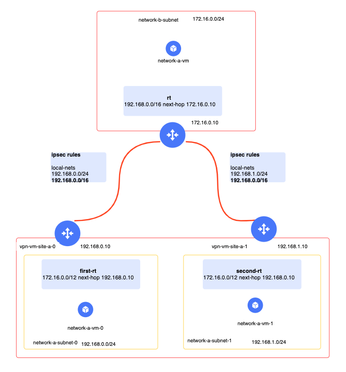
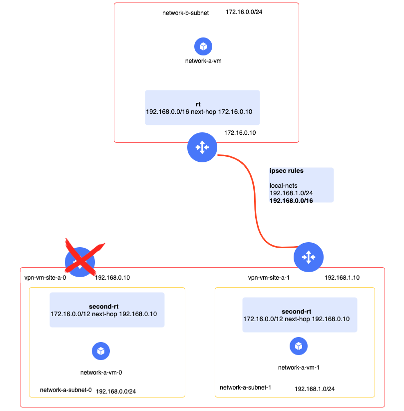

#  Сценарий отказоустойчивой ВМ-фаерволла

Данное решение предполагает использование двух ВМ виде VPN шлюзов. Текущая стенд эмулирует ситуацию когда VPN вм из Яндекс.Облака подключаются один отказойчивый кластер VPN концентраторов

## Пререквизиты для сценарий

- Закрепленный за вами архитектор Яндекс Облака, к которому можно придти с вопросами

-  [YC cli](https://cloud.yandex.com/docs/cli/quickstart)
- Bash
- Terraform 0.14
- jq


## Описание решения

Перед тем как использовать данное решение на своей сети, рекомендуем пройти по данному гайду и протестировать стенд, создаваемый в примере. Стенд написан в терраформе и создает


1) Сети, подсети, таблицы маршрутизации ( 01-networks.tf)
2) ВМ , которые поднимают  ( 02-vpn-vms.tf)
3) Пользовательские ВМ ( 03-user-vms.tf)
4) Инфраструктура и скрипты для фейловера таблиц маршрутизации в двух VPC ( 04-route-switcher.tf)


#### В обычном состоянии получается следующая схема




Те каждый из vpn шлюз обслуживает свои сабнеты, расположенные в разных АЗ при помощи закрепленной за ним таблице маршрутизации в режиме active-active. Также каждый vpn шлюз аннонсирует в vpn весь диапазон префиксов облака как резервный маршрут. 
Если вы используете ipsec + gre + протокол маршрутизации для работы туннелей, то вместо аггрегированного префикса можно просто посылать маршруты соседних аз с меньшей метрикой 


#### Если случается сбой на VPN-вм




1) Healthckeck сервис переводит апплаянс в режим unhealty
2) Фунции в каждой VPC меняют таблицу маршрутизации в сабнете которого случился сбой на запасную. В текущем виде запасной таблицей является таблица которая обслуживает другой апплаянс
3) Туннель также рвется, поэтому трафик начинает идти через запасную ВМ по туннелю, в котором есть аггрегированный префикс

 

#### Когда VPN-вм восстаналивается 

1) Healthckeck сервис переводит апплаянс в режим healty
2) Фунции в каждой VPC меняют таблицу маршрутизации в сабнете которого случился сбой на основную. 


Среднее время реакции на сбой такого решения - 1 минута ( так как скрипты проверки выполняются раз в минуту по крону)


#### Как проверить стенд в терраформа 


- Установите [YC cli](https://cloud.yandex.com/docs/cli/quickstart)
- Настройте авторизацию в YC для Terraform
```
export YC_TOKEN=$(yc iam create-token)
export YC_CLOUD_ID=$(yc config get cloud-id)
export YC_FOLDER_ID=$(yc config get folder-id)
``` 
## Тест стенда

Создайте переменную terraform.tfvars и запишите туда значение переменной folder_id ( смотрите файл terraform.tfvars_example)


Дальше запустите стенд

```
terraform init
terraform apply
```


### Ждем пару минут 

Тестируем связность

```bash
NETWORK_B_VM_ADDRESS=$(terraform output -json | jq -r .network_b_vm_internal_ip_address.value)
ssh ubuntu@$(terraform output -json | jq -r .network_a_vm_external_ip_address.value) "ping $NETWORK_B_VM_ADDRESS"
```
Смотрим на этом окне в пинги

```
Warning: Permanently added '54.244.68.241' (ECDSA) to the list of known hosts.
PING 10.10.0.28 (10.10.0.28) 56(84) bytes of data.
64 bytes from 172.16.1.4: icmp_seq=1 ttl=61 time=5.49 ms
64 bytes from 172.16.1.4: icmp_seq=2 ttl=61 time=4.23 ms
64 bytes from 172.16.1.4: icmp_seq=3 ttl=61 time=4.47 ms
```

### Останавливаем один из VPN-вм

Остановим vpn-vm-0 
```
yc compute instance stop --id $(terraform output -json | jq -r .vpn_vm_id.value)
```

Ждем когда пинги вернутся ( около минуты)

### Возращаем VPN-вм на место

```
yc compute instance start --id $(terraform output -json | jq -r .vpn_vm_id.value)
```


Ждем около минуты - будем наблюдать флап пингов так как таблицы маршрутизации перестраиваются обратно

### Завершение работы

Удалить стенд можно следующим способом

```bash
terraform destroy
```

Далее вам надо настроить модули для защиты вашей vpc по аналогии с тем , как описано в файле 04-route-switcher.tf. В частности


1) Один раз настроенный модуль multi-vpc-infra , который желательно настроить на management адреса vpn-vm
2) По настроенному модулю для каждой из защищаемых подсетей /multi-vpc-protected-network