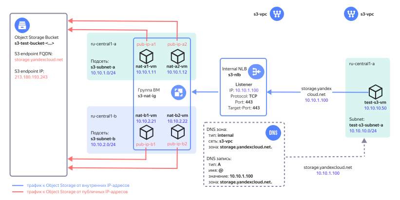

# Подключение к Object Storage из VPC

## Содержание
- [Описание решения](#описание-решения)
- [Рекомендации по развертыванию решения в продуктивной среде](#рекомендации-по-развертыванию-решения-в-продуктивной-среде)
- [Подготовка к развертыванию](#подготовка-к-развертыванию)
- [Развертывание Terraform сценария](#развертывание-terraform-сценария)
- [Проверка работоспособности](#проверка-работоспособности)
- [Удаление созданных ресурсов](#удаление-созданных-ресурсов)

## Описание решения

Подключиться к [Yandex Object Storage](https://cloud.yandex.ru/docs/storage/) в Yandex Cloud можно через соответствующий [API Endpoint](https://cloud.yandex.ru/docs/api-design-guide/concepts/endpoints/), FQDN которого потом преобразуется в публичный IP-адрес с помощью службы DNS.

В данном сценарии вы развернете в Yandex Cloud облачную инфраструктуру для организации доступа к Object Storage для ресурсов, которые размещены в облачной сети [VPC](https://cloud.yandex.ru/docs/vpc/concepts/) и не имеют публичных IP-адресов или выхода в интернет через [NAT-шлюз](https://cloud.yandex.ru/docs/vpc/concepts/gateways).



После развертывания решения в Yandex Cloud будут созданы следующие компоненты:

| Название | Описание |
| ---- | ---- |
| `s3-vpc` `*` | Облачная сеть с ресурсами, для которых организуется доступ к Object Storage. |
| `s3-nlb` | Внутренний сетевой балансировщик обеспечивает прием трафика к Object Storage. Балансировщик принимает TCP трафик с портом назначения 443 и распределяет его по ресурсам (ВМ) в целевой группе. |
| `s3-nat-group` | Целевая группа балансировщика с виртуальными машинами, на которых включена функция NAT. |
| `nat-a1-vm`, `nat-a2-vm`, `nat-b1-vm`, `nat-b2-vm` | Виртуальные машины с NAT в зонах `ru-central1-a` и `ru-central1-b` для передачи трафика к Object Storage и обратно с трансляцией IP-адресов источников и получателей трафика. | 
| `pub-ip-a1`, `pub-ip-a2`, `pub-ip-b1`, `pub-ip-b2` | Публичные IP-адреса ВМ, в которые облачная сеть VPC транслирует их внутренние IP-адреса. | 
| `DNS зона и A-запись` | Внутренняя DNS зона `storage.yandexcloud.net.` в сети `s3-vpc` с ресурсной `A` записью, сопоставляющей доменное имя `storage.yandexcloud.net` c IP-адресом внутреннего сетевого балансировщика. |
| `s3-bucket-<...>` | Бакет в Object Storage. |
| `s3-subnet-a`, `s3-subnet-b` | Облачные подсети для размещения ВМ с NAT в зонах `ru-central1-a` и `ru-central1-b`. |
| `test-s3-vm` | Тестовая ВМ для проверки доступа к Object Storage |
| `test-s3-subnet-a` | Облачная подсеть для размещения тестовой ВМ |

`*` *При развертывании можно также указать существующую облачную сеть*

Для облачной сети с размещаемыми ресурсами в сервисе [Cloud DNS](https://cloud.yandex.ru/docs/dns/concepts/) создается внутренняя зона `storage.yandexcloud.net.` и ресурсная `A` запись, сопоставляющая доменное имя `storage.yandexcloud.net` сервиса Object Storage c IP-адресом [внутреннего сетевого балансировщика](https://cloud.yandex.ru/docs/network-load-balancer/concepts/nlb-types). Благодаря этой записи трафик от облачных ресурсов к Object Storage будет направляться на внутренний балансировщик, который будет распределять нагрузку по виртуальным машинам с NAT. 

Для развертывания ВМ с NAT используется [образ из Marketplace](https://cloud.yandex.ru/marketplace/products/yc/nat-instance-ubuntu-22-04-lts), который обеспечивает трансляции IP-адресов источника и назначения, чтобы обеспечить маршрутизацию трафика до публичного IP-адреса Object Storage.

Разместив ВМ с NAT в нескольких [зонах доступности](https://cloud.yandex.ru/docs/overview/concepts/geo-scope), можно получить отказоустойчивость доступа к Object Storage. Увеличивая количество ВМ с NAT, можно масштабировать решение при возрастании нагрузки. При расчете количества ВМ с NAT следует учитывать [локальность при обработке трафика внутренним балансировщиком](https://cloud.yandex.ru/docs/network-load-balancer/concepts/specifics#nlb-int-locality). 

[Политика доступа Object Storage](https://cloud.yandex.ru/docs/storage/concepts/policy) разрешает действия с бакетом только с публичных IP-адресов ВМ с NAT. Доступ к бакету открыт только для облачных ресурсов, использующих данное решение. Подключиться к бакету в Object Storage через публичный API Endpoint не получится. При необходимости это ограничение можно отключить с помощью параметра в Terraform.


## Рекомендации по развертыванию решения в продуктивной среде

- При развертывании ВМ с NAT в нескольких зонах доступности рекомендуется указывать четное число ВМ для их равномерного распределения по зонам доступности.
- Выбирая количество ВМ с NAT, следует учитывать [локальность при обработке трафика внутренним балансировщиком](https://cloud.yandex.ru/docs/network-load-balancer/concepts/specifics#nlb-int-locality).
- После ввода решения в эксплуатацию рекомендуется уменьшать количество ВМ с NAT или изменять список зон доступности в параметре `yc_availability_zones` только в заранее запланированный период времени. В процессе применения изменений возможны прерывания в обработке трафика.
- По умолчанию доступ к бакету в Object Storage разрешен через консоль управления Yandex Cloud. Это разрешение можно отменить с помощью параметра `bucket_console_access = false`. 
- Если не указать параметр `mgmt_ip` при `bucket_private_access = true`, то развертывание решения с помощью Terraform на рабочей станции будет завершаться с ошибкой доступа к бакету.
- В случае использования собственного DNS сервера в его настройках необходимо создать ресурсные `A` записи вида:

    | Имя | Тип | Значение |
    | ----------- | ----------- | ----------- |
    | `storage.yandexcloud.net.` | `A` | `<IP-адрес_внутреннего_балансировщика>` |
    | `<имя_бакета>.storage.yandexcloud.net.` | `A` | `<IP-адрес_внутреннего_балансировщика>` |
- Сохраните приватный SSH ключ `pt_key.pem`, используемый для подключения к ВМ с NAT, в надежное место либо пересоздайте его отдельно от Terraform.
- После развертывания решения доступ по SSH к ВМ c NAT будет закрыт. Для разрешения доступа к ВМ с NAT по протоколу SSH добавьте входящее правило для SSH трафика (TCP/22) в группе безопасности `s3-nat-sg`, чтобы разрешить доступ только с определенных IP-адресов рабочих мест администраторов.
- После проверки работоспособности удалите тестовую ВМ и её подсеть.


## Подготовка к развертыванию

1. Перед выполнением развертывания нужно [зарегистрироваться в Yandex Cloud и создать платежный аккаунт](https://cloud.yandex.ru/docs/tutorials/infrastructure-management/terraform-quickstart#before-you-begin)

2. [Установите Terraform](https://cloud.yandex.ru/docs/tutorials/infrastructure-management/terraform-quickstart#install-terraform)

3. Проверьте наличие учетной записи в облаке с правами `admin` на каталог

4. [Установите Git](https://github.com/git-guides/install-git)

5. Проверьте квоты в облаке, чтобы была возможность развернуть ресурсы в сценарии:

    <details>
    <summary>Посмотреть справочную информацию по количеству ресурсов, создаваемых в сценарии</summary>

    | Ресурс | Количество |
    | ----------- | ----------- |
    | Виртуальные машины | 5 |
    | vCPU виртуальных машин | 10 |
    | RAM виртуальных машин | 10 ГБ |
    | Диски | 5 |
    | Объем HDD дисков | 30 ГБ |
    | Объем SSD дисков | 40 ГБ |
    | Сетевой балансировщик | 1 |
    | Целевая группа для балансировщика | 1 |
    | Сети | 1`*` |
    | Подсети | 3 |
    | Статические публичные IP-адреса | 4 |
    | Группы безопасности | 1 |
    | Зона DNS | 1 |
    | Бакет | 1 |  
    | Сервисный аккаунт | 2 |
    | Статический ключ для сервисного аккаунта | 1 |

    `*` *Если пользователь в `terraform.tfvars` не указал идентификатора существующей сети.*

    </details>


6. Перед развёртыванием решения уже должен существовать каталог облачных ресурсов в Yandex Cloud, в котором будут размещаться компоненты решения.


## Развертывание Terraform сценария

1. На вашей рабочей станции склонируйте [репозиторий](https://github.com/yandex-cloud/yc-architect-solution-library/) `yandex-cloud/yc-architect-solution-library` из GitHub и перейдите в папку сценария `yc-s3-private-endpoint`:
    ```bash
    git clone https://github.com/yandex-cloud/yc-architect-solution-library.git
    
    cd yc-architect-solution-library/yc-s3-private-endpoint
    ```

2. Настройте окружение для развертывания ([подробности](https://cloud.yandex.ru/docs/tutorials/infrastructure-management/terraform-quickstart#get-credentials)):
    ```bash
    export YC_TOKEN=$(yc iam create-token)
    ```

3. Заполните файл `terraform.tfvars` вашими значениями. Обязательные параметры для изменения отмечены в таблице.

    <details>
    <summary>Посмотреть детальную информацию о заполняемых значениях</summary>

    | Название<br>параметра | Нужно<br>изменение | Описание | Тип | Пример |
    | --- | --- | --- | --- | --- |
    | `folder_id` | да | ID каталога для размещения компонент решения. | `string` | `b1gentmqf1ve9uc54nfh` |
    | `vpc_id` | - | ID облачной сети, для которой организуется доступ к Object Storage. Если не указано, то VPC будет создана. | `string` | `enp48c1ndilt42veuw4x` |
    | `yc_availability_zones` | - | Список <a href="https://cloud.yandex.ru/docs/overview/concepts/geo-scope">зон доступности</a> для развертывания ВМ с NAT.  | `list(string)` | `["ru-central1-a", "ru-central1-b"]` |
    | `subnet_prefix_list` | - | Список префиксов облачных подсетей для размещения ВМ с NAT (по одной подсети в каждой зоне доступности из списка `yc_availability_zones`, перечисленных в порядке: ru-central1-a, ru-central1-b и т.д.). | `list(string)` | `["10.10.1.0/24", "10.10.2.0/24"]` |
    | `nat_instances_count` | - | Количество разворачиваемых ВМ с NAT. Рекомендуется указывать четное число для равномерного распределения ВМ по зонам доступности. | `number` | `4` |
    | `bucket_private_access` | - | Ограничить доступ к бакету только с публичных IP-адресов ВМ с NAT. Используется значение `true` для ограничения, `false` для отмены ограничения. | `bool` | `true` |
    | `bucket_console_access` | - | Разрешить доступ к бакету через консоль управления Yandex Cloud. Используется значение `true` для разрешения, `false` для запрета. Требует указания, когда параметр `bucket_private_access` имеет значение `true`. | `bool` | `true` |
    | `mgmt_ip` | да | Публичный IP-адрес рабочей станции, на которой происходит развертывание Terraform сценария. Используется для разрешения рабочей станции выполнять действия с бакетом в процессе развертывания Terraform. Требует указания, когда параметр `bucket_private_access` имеет значение `true`. | `string` | `A.A.A.A` |
    | `trusted_cloud_nets` | да | Список агрегированных префиксов облачных подсетей, для которых разрешен доступ к Object Storage. Используется во входящем правиле групп безопасности для ВМ с NAT.  | `list(string)` | `["10.0.0.0/8", "192.168.0.0/16"]` |
    | `vm_username` | - | Имя пользователя для ВМ с NAT и тестовой ВМ. | `string` | `admin` |
    | `s3_ip` | нет | Публичный IP-адрес сервиса Object Storage. | `string` | `213.180.193.243` |
    | `s3_fqdn` | нет | Доменное имя сервиса Object Storage. | `string` | `storage.yandexcloud.net` |  
    
    </details>

4. Выполните инициализацию Terraform:
    ```bash
    terraform init
    ```

5. Проверьте список создаваемых облачных ресурсов:
    ```bash
    terraform plan
    ```

6. Создайте ресурсы:
    ```bash
    terraform apply
    ```

7. После завершения процесса `terraform apply` в командной строке будет выведен список информации для подключения к тестовой ВМ и тестирования работы с Object Storage. В дальнейшем его можно будет посмотреть с помощью команды `terraform output`:

    <details>
    <summary>Посмотреть информацию о развернутых ресурсах</summary>

    | Название | Описание | Пример значения |
    | ----------- | ----------- | ----------- |
    | `path_for_private_ssh_key` | Файл с private ключом для подключения по протоколу SSH к ВМ с NAT и тестовой ВМ. | `./pt_key.pem` |
    | `vm_username` | Имя пользователя для ВМ с NAT и тестовой ВМ. | `admin` |
    | `test_vm_password` | Пароль пользователя `admin` для тестовой ВМ. | `v3RСqUrQN?x)` |
    | `s3_bucket_name` | Имя бакета в Object Storage. | `s3-bucket-5efzzpvmys` |
    | `s3_nlb_ip_address` | IP-адрес внутреннего балансировщика. | `10.10.1.100` |
    
    </details>


## Проверка работоспособности

1. В консоли Yandex Cloud в каталоге `folder_id` выберите сервис `Compute Cloud` и в списке виртуальных машин выберите ВМ `test-s3-vm`. Подключитесь к серийной консоли ВМ, введите логин `admin` и пароль из вывода команды `terraform output test_vm_password` (укажите значение без кавычек).

2. В серийной консоли ВМ выполните команду `dig storage.yandexcloud.net` и убедитесь, что в ответе от DNS сервера доменному имени сервиса Object Storage соответствует IP-адрес внутреннего балансировщика. Результат вывода ресурсной `A` записи:
    ```
    ;; ANSWER SECTION:
    storage.yandexcloud.net. 300    IN      A       10.10.1.100
    ```

3. Получите объект из бакета в Object Storage с помощью команды инструмента [AWS CLI](https://cloud.yandex.ru/docs/storage/tools/aws-cli). Имя бакета будет получено из переменной среды на тестовой ВМ. 

    ```
    aws --endpoint-url=https://storage.yandexcloud.net \
    s3 cp s3://$BUCKET/s3_test_file.txt s3_test_file.txt
    ```

    Результат:
    ```
    download: s3://<имя-бакета>/s3_test_file.txt to ./s3_test_file.txt
    ```

4. Дополнительно можете выполнить несколько команд для проверки работы с Object Storage. Имя бакета будет получено из переменной среды на тестовой ВМ.
   
   Загрузите скачанный тестовый файл в бакет под другим именем:
    ```
    aws --endpoint-url=https://storage.yandexcloud.net \
    s3 cp s3_test_file.txt s3://$BUCKET/textfile.txt
    ```
    
    Результат:
    ```
    upload: ./s3_test_file.txt to s3://<имя-бакета>/textfile.txt
    ```

    Получите список объектов в бакете:
    ```
    aws --endpoint-url=https://storage.yandexcloud.net \
    s3 ls --recursive s3://$BUCKET
    ```

    Результат:
    ```
    2023-08-16 18:24:05         53 s3_test_file.txt \
    2023-08-16 18:41:39         53 textfile.txt
    ```

    Удалите загруженный в бакет объект:
    ```
    aws --endpoint-url=https://storage.yandexcloud.net \
    s3 rm s3://$BUCKET/textfile.txt
    ```

    Результат:
    ```
    delete: s3://<имя-бакета>/textfile.txt
    ```


## Удаление созданных ресурсов

Чтобы удалить ресурсы, созданные с помощью Terraform, выполните команду `terraform destroy`.

> **Важно**
> 
> Terraform удалит все ресурсы, которые были созданы при развертывании решения, без возможности восстановления.

