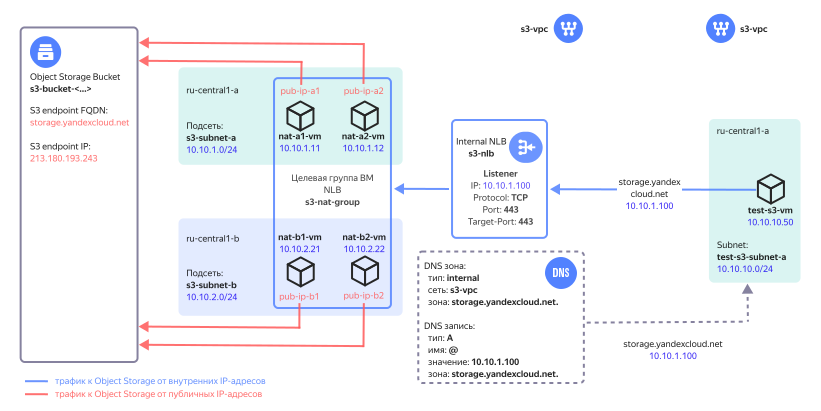

# Организация подключения к Object Storage для облачных ресурсов без доступа в интернет

## Содержание
- [Описание решения](#описание-решения)
- [Подготовка к развертыванию](#подготовка-к-развертыванию)
- [Развертывание Terraform сценария](#развертывание-terraform-сценария)
- [Проверка работоспособности](#проверка-работоспособности)
- [Требования к развертыванию в продуктивной среде](#требования-к-развертыванию-в-продуктивной-среде)
- [Удаление созданных ресурсов](#удаление-созданных-ресурсов)

## Описание решения

Обращение к [Yandex Object Storage](https://cloud.yandex.ru/docs/storage/) выполняется через публичный IP-адрес этого сервиса. С помощью предлагаемого решения можно обеспечить доступ к Object Storage для облачных ресурсов Yandex Cloud, не имеющих публичных IP-адресов или выхода в интернет.

Для облачной сети с размещаемыми ресурсами в [Cloud DNS](https://cloud.yandex.ru/docs/dns/concepts/) создается внутренняя зона `storage.yandexcloud.net.` и ресурсная `A` запись, сопоставляющая доменное имя `storage.yandexcloud.net` сервиса Object Storage c IP-адресом внутреннего [сетевого балансировщика](https://cloud.yandex.ru/docs/network-load-balancer/concepts/). Благодаря этой записи трафик облачных ресурсов к Object Storage направляется на внутренний балансировщик, который распределяет нагрузку по виртуальным машинам NAT-инстансов. [NAT-инстанс](https://cloud.yandex.ru/marketplace/products/yc/nat-instance-ubuntu-18-04-lts) выполняет трансляции IP-адресов источника и назначения, чтобы обеспечить маршрутизацию трафика до публичного IP-адреса Object Storage.

Разместив NAT-инстансы в нескольких [зонах доступности](https://cloud.yandex.ru/docs/overview/concepts/geo-scope), можно обеспечить отказоустойчивость доступа к Object Storage. Заданием количества NAT-инстансов можно управлять производительностью доступа к Object Storage. Выбирая количество NAT-инстансов, учитывайте [локальность при обработке трафика внутренним балансировщиком](https://cloud.yandex.ru/docs/network-load-balancer/concepts/specifics#nlb-int-locality). 

[Политика доступа](https://cloud.yandex.ru/docs/storage/concepts/policy) разрешает действия с бакетом только с публичных IP-адресов NAT-инстансов. Доступ к бакету открыт только для облачных ресурсов, использующих данное решение. При необходимости это ограничение можно отключить с помощью параметра в Terraform.

**Схема решения**




После развертывания решения в Yandex Cloud будут созданы следующие компоненты:

| Название | Описание |
| ---- | ---- |
| `s3-vpc` `*` | Облачная сеть с ресурсами, для которых организуется доступ к Object Storage |
| `s3-nlb` | Внутренний сетевой балансировщик для распределения нагрузки к Object Storage по виртуальным машинам NAT-инстансов. Обрабатывает TCP трафик с портом назначения 443. |
| `s3-nat-group` | Целевая группа балансировщика с виртуальными машинами NAT-инстанс |
| `nat-a1-vm`, `nat-a2-vm`, `nat-b1-vm`, `nat-b2-vm` | NAT-инстансы в зонах ru-central1-a и ru-central1-b для трансляции IP-адресов источника в IP-адрес NAT-инстанс и трансляции IP-адреса назначения в публичный IP-адрес Object Storage | 
| `pub-ip-a1`, `pub-ip-a2`, `pub-ip-b1`, `pub-ip-b2` | Публичные IP-адреса NAT-инстансов, в которые облачная сеть VPC транслирует их внутренние IP-адреса | 
| `DNS зона и запись` | Внутренняя DNS зона `storage.yandexcloud.net.` в сети `s3-vpc` с ресурсной `A` записью, сопоставляющей доменное имя `storage.yandexcloud.net` c IP-адресом внутреннего балансировщика |
| `s3-bucket-<...>` | Тестовый бакет в Object Storage для проверки доступа из тестовой ВМ |
| `s3-subnet-a`, `s3-subnet-b` | Облачные подсети для размещения NAT-инстансов в зонах ru-central1-a и ru-central1-b |
| `test-s3-vm` | Тестовая ВМ для проверки доступа к Object Storage |
| `test-s3-subnet-a` | Облачная подсеть для размещения тестовой ВМ |

`*` При развертывании можно также указать существующую облачную сеть

## Подготовка к развертыванию

1. Перед выполнением развертывания нужно [зарегистрироваться в Yandex Cloud и создать платежный аккаунт](https://cloud.yandex.ru/docs/tutorials/infrastructure-management/terraform-quickstart#before-you-begin)

2. [Установите Terraform](https://cloud.yandex.ru/docs/tutorials/infrastructure-management/terraform-quickstart#install-terraform)

3. Проверьте наличие учетной записи в облаке с правами `admin` на каталог

4. [Установите и настройте Yandex Cloud CLI](https://cloud.yandex.ru/docs/cli/quickstart)

5. [Установите Git](https://github.com/git-guides/install-git)

6. Проверьте квоты в облаке, чтобы была возможность развернуть ресурсы в сценарии:

    <details>
    <summary>Посмотреть справочную информацию по количеству ресурсов, создаваемых в сценарии</summary>

    | Ресурс | Количество |
    | ----------- | ----------- |
    | Виртуальные машины | 5 |
    | vCPU виртуальных машин | 10 |
    | RAM виртуальных машин | 10 ГБ |
    | Диски | 5 |
    | Объем HDD дисков | 30 ГБ |
    | Объем SSD дисков | 40 ГБ |
    | Сетевой балансировщик | 1 |
    | Целевая группа для балансировщика | 1 |
    | Сети | 1`*` |
    | Подсети | 3 |
    | Статические публичные IP-адреса | 4 |
    | Группы безопасности | 1 |
    | Зона DNS | 1 |
    | Бакет | 1 |  
    | Сервисный аккаунт | 2 |
    | Статический ключ для сервисного аккаунта | 1 |

    `*` Если пользователь в `terraform.tfvars` не указал идентификатора существующей сети.

    </details>


7. Перед развёртыванием решения уже должен существовать каталог облачных ресурсов в Yandex Cloud, в котором будут размещаться компоненты решения.


## Развертывание Terraform сценария

1. На вашей рабочей станции склонируйте [репозиторий](https://github.com/yandex-cloud/yc-architect-solution-library/) `yandex-cloud/yc-architect-solution-library` из GitHub и перейдите в папку сценария `yc-s3-private-endpoint`:
    ```bash
    git clone https://github.com/yandex-cloud/yc-architect-solution-library.git
    
    cd yc-architect-solution-library/yc-s3-private-endpoint
    ```

2. Настройте окружение для развертывания ([подробности](https://cloud.yandex.ru/docs/tutorials/infrastructure-management/terraform-quickstart#get-credentials)):
    ```bash
    export YC_TOKEN=$(yc iam create-token)
    ```

3. Заполните файл `terraform.tfvars` вашими значениями. Обязательные параметры для изменения отмечены в таблице.

    <details>
    <summary>Посмотреть детальную информацию о заполняемых значениях</summary>

    | Название | Описание | Тип | Пример | Требует изменения |
    | ----------- | ----------- | ----------- | ----------- | ---------- |
    | `folder_id` | ID каталога для размещения компонент решения | `string` | `"b1gentmqf1ve9uc54nfh"` | да |
    | `vpc_id` | ID облачной сети, для которой организуется доступ к Object Storage. Если не указано, то VPC будет создана. | `string` | `"enp48c1ndilt42veuw4x"` |  |
    | `yc_availability_zones` | Список <a href="https://cloud.yandex.ru/docs/overview/concepts/geo-scope">зон доступности</a> для развертывания NAT-инстансов  | `list(string)` | `["ru-central1-a", "ru-central1-b"]` | |
    | `subnet_prefix_list` | Список префиксов облачных подсетей для размещения NAT-инстансов (по одной подсети в каждой зоне доступности из списка `yc_availability_zones`, перечисленных в порядке: ru-central1-a, ru-central1-b и т.д.). | `list(string)` | `["10.10.1.0/24", "10.10.2.0/24"]` | |
    | `nat_instances_count` | Количество разворачиваемых NAT-инстансов. Рекомендуется указывать четное число для равномерного распределения NAT-инстансов по зонам доступности. | `number` | `4` | |
    | `bucket_private_access` | Ограничить доступ к бакету только с публичных IP-адресов NAT-инстансов. Используется значение `true` для ограничения, `false` для отмены ограничения. | `bool` | `true` | |
    | `bucket_console_access` | Разрешить доступ к бакету через консоль управления Yandex Cloud. Используется значение `true` для разрешения, `false` для запрета. Требует указания, когда параметр `bucket_private_access` имеет значение `true`. | `bool` | `true` | |
    | `mgmt_ip` | Публичный IP-адрес рабочей станции, на которой происходит развертывание Terraform сценария. Используется для разрешения рабочей станции выполнять действия с бакетом в процессе развертывания Terraform. Требует указания, когда параметр `bucket_private_access` имеет значение `true`. | `string` | `"A.A.A.A"` | да |
    | `trusted_cloud_nets` | Список агрегированных префиксов облачных подсетей, для которых разрешен доступ к Object Storage. Используется во входящем правиле групп безопасности для NAT-инстансов.  | `list(string)` | `["10.0.0.0/8", "192.168.0.0/16"]` | да |
    | `vm_username` | Имя пользователя для NAT-инстансов и тестовой ВМ | `string` | `"admin"` |  |
    | `s3_ip` | Публичный IP-адрес сервиса Object Storage | `string` | `"213.180.193.243"` | нет |
    | `s3_fqdn` | Доменное имя сервиса Object Storage | `string` | `"storage.yandexcloud.net"` | нет |    

    
    </details>

4. Выполните инициализацию Terraform:
    ```bash
    terraform init
    ```

5. Проверьте список создаваемых облачных ресурсов:
    ```bash
    terraform plan
    ```

6. Создайте ресурсы:
    ```bash
    terraform apply
    ```

7. После завершения процесса terraform apply в командной строке будет выведен список информации для подключения к тестовой ВМ и тестирования работы с Object Storage. В дальнейшем его можно будет посмотреть с помощью команды `terraform output`:

    <details>
    <summary>Посмотреть информацию о развернутых ресурсах</summary>

    | Название | Описание | Пример значения |
    | ----------- | ----------- | ----------- |
    | `path_for_private_ssh_key` | Файл с private ключом для подключения по протоколу SSH к NAT-инстансам и тестовой ВМ | `"./pt_key.pem"` |
    | `vm_username` | Имя пользователя для NAT-инстансов и тестовой ВМ | `"admin"` |
    | `test_vm_password` | Пароль пользователя `admin` для тестовой ВМ | `"v3RСqUrQN?x)"` |
    | `s3_bucket_name` | Имя тестового бакета Object Storage | `s3-bucket-5efzzpvmys` |
    | `s3_nlb_ip_address` | IP-адрес внутреннего балансировщика | `"10.10.1.100"` |
    | `s3_test_command` | Команда для тестирования работы Object Storage | `"aws --endpoint-url=https://storage.yandexcloud.net s3 cp s3://s3-bucket-5efzzpvmys/s3_test_file.txt s3_test_file.txt"` |

    </details>


## Проверка работоспособности

1. В консоли Yandex Cloud в каталоге `folder_id` выберите сервис `Compute Cloud` и в списке виртуальных машин выберите ВМ `test-s3-vm`. Подключитесь к серийной консоли ВМ, введите логин `admin` и пароль из вывода команды `terraform output test_vm_password` (укажите значение без кавычек).

2. Выполните команду `dig storage.yandexcloud.net` и убедитесь, что в ответе от DNS сервера доменному имени сервиса Object Storage соответствует IP-адрес внутреннего балансировщика. Результат вывода ресурсной `A` записи:
    ```
    ;; ANSWER SECTION:
    storage.yandexcloud.net. 300    IN      A       10.10.1.100
    ```

3. Выполните команду из вывода `terraform output s3_test_command`. Эта команда [AWS CLI](https://cloud.yandex.ru/docs/storage/tools/aws-cli) получает объект из тестового бакета в Object Storage.
    ```
    aws --endpoint-url=https://storage.yandexcloud.net s3 cp s3://<имя_бакета>/s3_test_file.txt s3_test_file.txt
    ```
    Результат:
    ```
    download: s3://<имя_бакета>/s3_test_file.txt to ./s3_test_file.txt
    ``` 

4. Дополнительно можете выполнить несколько команд для проверки работы с Object Storage. Замените `<имя_бакета>` в командах на значение из вывода `terraform output s3_bucket_name`.
   
   Загрузите скачанный тестовый файл в бакет под другим именем:
    ```
    aws --endpoint-url=https://storage.yandexcloud.net s3 cp s3_test_file.txt s3://<имя_бакета>/textfile.txt
    ```
    Результат:
    ```
    upload: ./s3_test_file.txt to s3://<имя_бакета>/textfile.txt
    ```

    Получите список объектов в бакете:

    ```
    aws --endpoint-url=https://storage.yandexcloud.net s3 ls --recursive s3://<имя_бакета>
    ```
    Результат:
    ```
    2023-08-16 18:24:05         53 s3_test_file.txt
    2023-08-16 18:41:39         53 textfile.txt
    ```

    Удалите загруженный в бакет объект:
    
    ```
    aws --endpoint-url=https://storage.yandexcloud.net s3 rm s3://<имя_бакета>/textfile.txt
    ```
    Результат:
    ```
    delete: s3://<имя_бакета>/textfile.txt
    ```


## Рекомендации к развертыванию в продуктивной среде

- При развертывании NAT-инстансов в нескольких зонах доступности рекомендуется указывать четное число NAT-инстансов для равномерного распределения NAT-инстансов по зонам доступности
- Выбирая количество NAT-инстансов, учитывайте [локальность при обработке трафика внутренним балансировщиком](https://cloud.yandex.ru/docs/network-load-balancer/concepts/specifics#nlb-int-locality)
- Работы по уменьшению количества NAT-инстансов или изменению списка зон доступности в параметре `yc_availability_zones` после ввода решения в эксплуатацию рекомендуется проводить во время согласованного технологического окна
- По умолчанию доступ к бакету разрешен через консоль управления Yandex Cloud. Это разрешение можно отменить с помощью параметра `bucket_console_access = false`. 
- Если не указать параметр `mgmt_ip` при `bucket_private_access = true`, то развертывание решения с помощью Terraform на рабочей станции будет завершаться с ошибкой доступа к бакету
- В случае использования собственного DNS сервера в его настройках необходимо создать ресурсные `A` записи вида:

    | Имя | Тип | Значение |
    | ----------- | ----------- | ----------- |
    | `storage.yandexcloud.net.` | `A` | `<IP-адрес_внутреннего_балансировщика>` |
    | `<имя_бакета>.storage.yandexcloud.net.` | `A` | `<IP-адрес_внутреннего_балансировщика>` |
- Сохраните приватный SSH ключ pt_key.pem, используемый для подключения к NAT-инстансам, в надежное место либо пересоздайте его отдельно от Terraform
- Для доступа к NAT-инстансам по SSH добавьте входящее правило для SSH трафика в группе безопасности `s3-nat-sg` с ограниченного списка IP адресов администраторов
- После проверки работоспособности удалите тестовую ВМ и её подсеть


## Удаление созданных ресурсов

Чтобы удалить ресурсы, созданные с помощью Terraform, выполните команду `terraform destroy`.

> **Внимание**
> 
> Terraform удалит все ресурсы, созданные в этом сценарии, **без возможности восстановления**.

