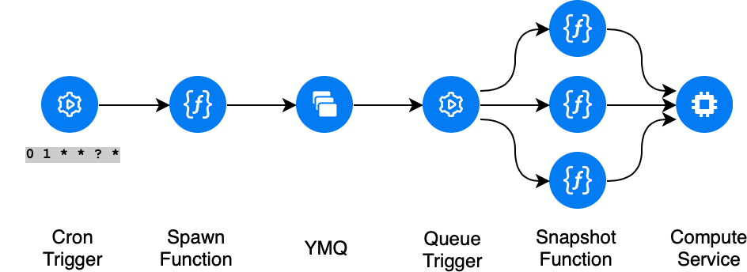
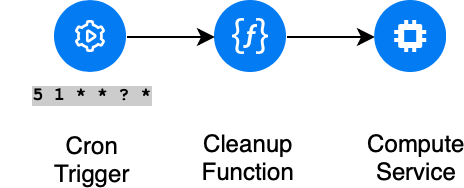

# Snapshot based backup tool on Yandex.Cloud
Origin: https://github.com/nikolaymatrosov/go-yc-serverless-snapshot
### Принцип работы
В облаке существует лимит на количество одновременно запущенных в облаке операций. По умолчанию он равен 15.

Это значит, что если мы хотим делать снепшоты более чем 15 дисков, простое решение с одной функцией которая запустит оперции создания снепшота нам не подойдет.

Чтобы не заморачиваться с ретраями и ожиданием окончания создания снепшота можно воспользоваться очередью сообщений.

И так, первая функция, которая будет триггериться по cron'у будет складывать в очередь сообщений задания для второй функции.

Вторая функция будет срабатывать по триггеру, который мы свяжем с очередью сообщений, будет как раз выполнять полезную работу — создавть снепшоты.

В случае если Compute API ответит нам ошибкой, например потому, что превышенно квота на одновремнно запущенные операции, функция выбросит исключение.
Сообщение не будет удалено из очереди и через некоторое время снова станет доступно для вычитывания. Таким образом мы получим автоматические ретраи.



С отчисткой старых  снепшотов все проще. При создании снепшота ему проставляется лейбл `expiration_ts` содержащий unix-timestamp когда этот снепшот можно удалить.
По cron будет срабатывать триггер и запускать функцию удаления просроченных снепшотов. Тут с ограничениями на количество операций я не сталкнулся.



## Требования
- Terraform ~>0.14
- YC cli

### Настройка Yandex.Cloud

- Установите [YC cli](https://cloud.yandex.com/docs/cli/quickstart)
- Настройте авторизацию в YC для Terraform
```
export YC_TOKEN=$(yc iam create-token)
export YC_CLOUD_ID=$(yc config get cloud-id)
export YC_FOLDER_ID=$(yc config get folder-id)
``` 
## Quick start

Опционально переопределите переменные `mv terraform.example terraform.tfvars`, описание переменных доступно в `variables.tf`.

Если в переменной `MODE` указано `only-marked`, то снепшоты будут создаваться только для дисков,
у которых проставлен лейбл `snapshot`. Иначе снепшотиться будут все диски.

```
terraform init
terraform apply
```
 ### Описание переменных


| Name                   | Description                                                                                                                                                     | Type       | Default                                     | Required |
| ---------------------- | --------------------------------------------------------------------------------------------------------------------------------------------------------------- | ---------- | ------------------------------------------- | :------: |
| create\_cron           | Regularity of snapshot creation. Cron expression must be in format like https://cloud.yandex.com/docs/functions/concepts/trigger/timer#cron-expression          | `string`   | `"0 22 * * ? *"`                            |    no    |
| delete\_cron           | Regularity of deleting expired snapshots. Cron expression must be in format like https://cloud.yandex.com/docs/functions/concepts/trigger/timer#cron-expression | `string`   | `"0 23 * * ? *"`                            |    no    |
| execution\_timeout     | Execution\_timeout for Cloud Functions                                                                                                                          | `number`   | `30`                                        |    no    |
| folder\_id             | Existing Folder\_ID to be used for Cloud Functions. If omiting Folder-ID will be set from yc cli profile                                                        | `string`   | `null`                                      |    no    |
| labels                 | Additional lables                                                                                                                                               | `map(any)` | <pre>{<br>  "purpose": "backups"<br>}</pre> |    no    |
| memory                 | RAM memory for Cloud Functions                                                                                                                                  | `number`   | `128`                                       |    no    |
| mode                   | Function mode: # all # only-marked                                                                                                                              | `string`   | `"all"`                                     |    no    |
| service\_account\_name | Name of service account to create to be used for Cloud Functions.                                                                                               | `string`   | `"sa-backup-functions"`                     |    no    |
| ttl                    | Snapshot Time To Live in seconds. 1 week = 60x60x24x7 = 604800                                                                                                  | `string`   | `"604800"`                                  |    no    |
